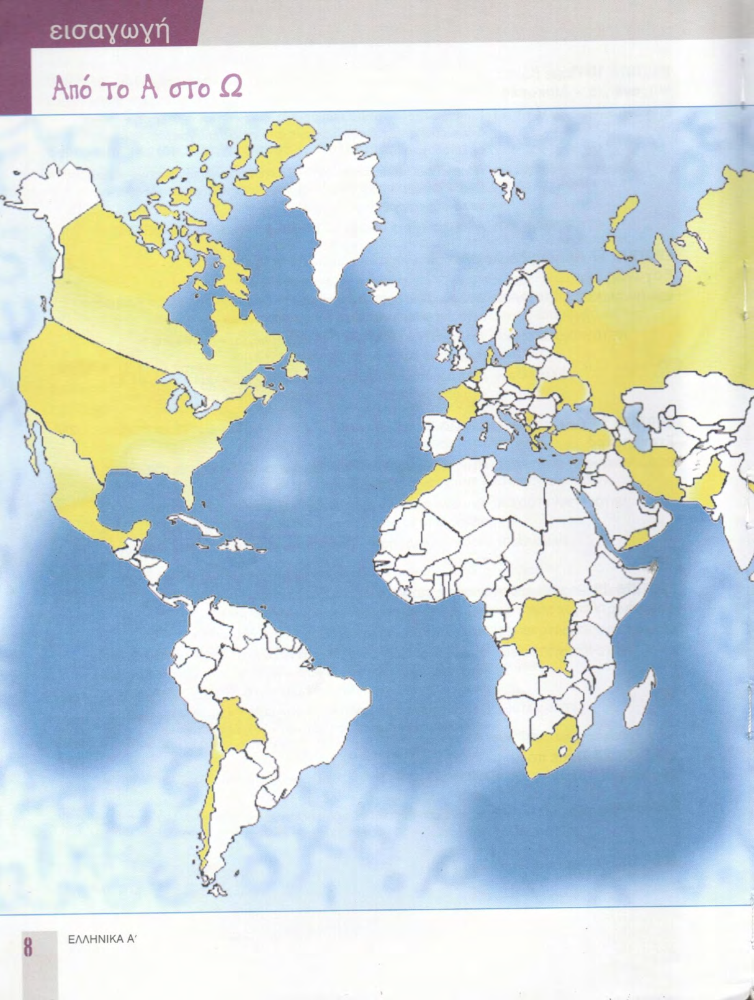
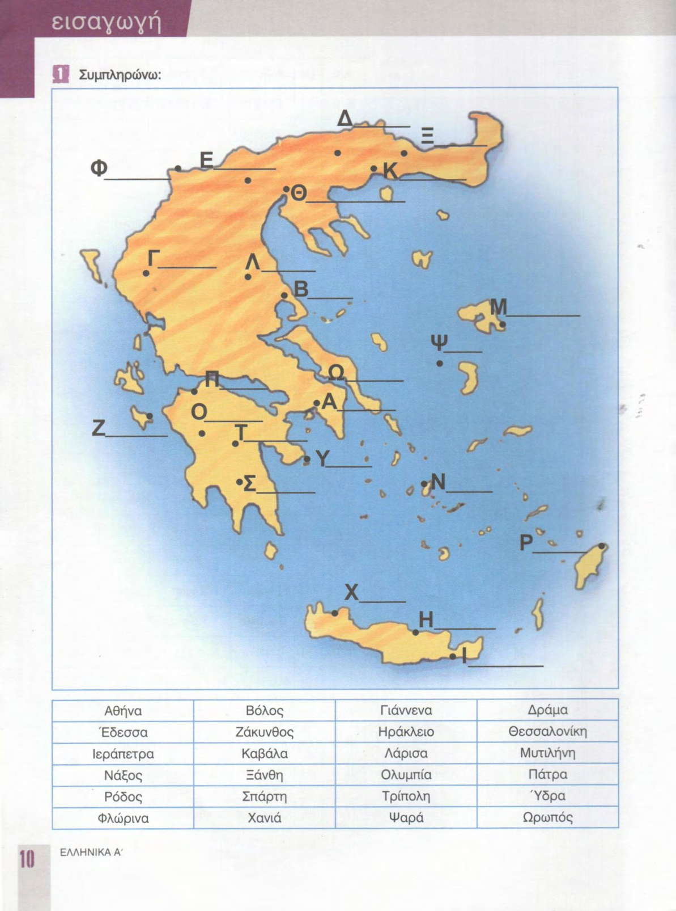
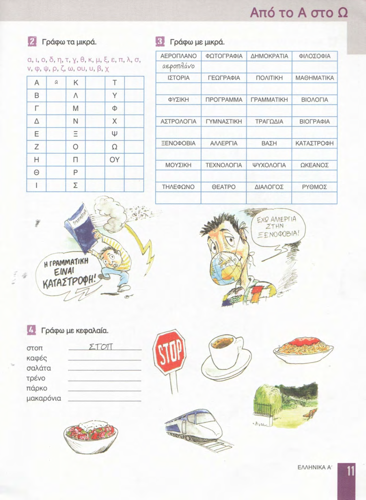

# 📚 Страницы учебника — урок 0

**[🏠 Readme](../../../Readme.md) → [📘 book/pages](../) → 📄 `content.md`**

| ⚡ Быстрые ссылки |                                                          |
|------------------|----------------------------------------------------------|
| 📘 Урок          | [lesson.md](../../../modules/lesson_0/lesson.md)         |
| 📑 Оглавление    | [К навигации](#lesson-pages-nav)                         |
| 🖼 Просмотр       | [К превью](#lesson-pages-preview)                        |

## 🔢 Навигация по страницам

- [8](8.png) · [9](9.png) · [10](10.png) · [11](11.png) · [12](12.png) · [13](13.png)

## 🖼 Просмотр страниц

Ниже — те же файлы в порядке номеров страницы (удобно листать сверху вниз).

### Стр. 8

### Стр. 9

### Стр. 10

### Стр. 11

### Стр. 12

### Стр. 13

