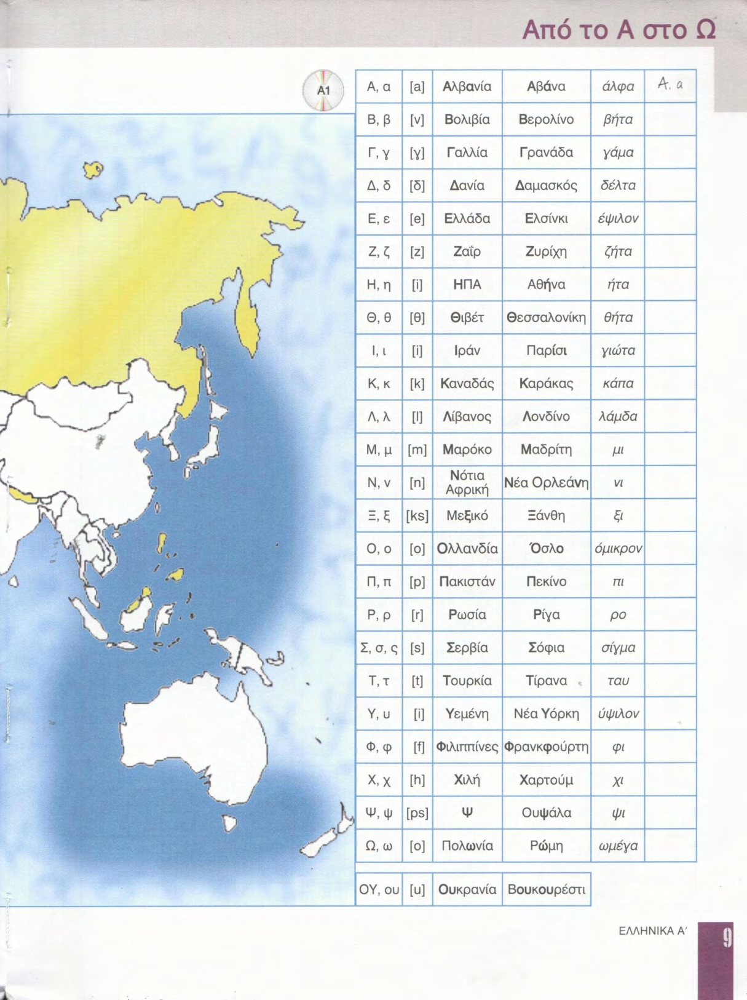
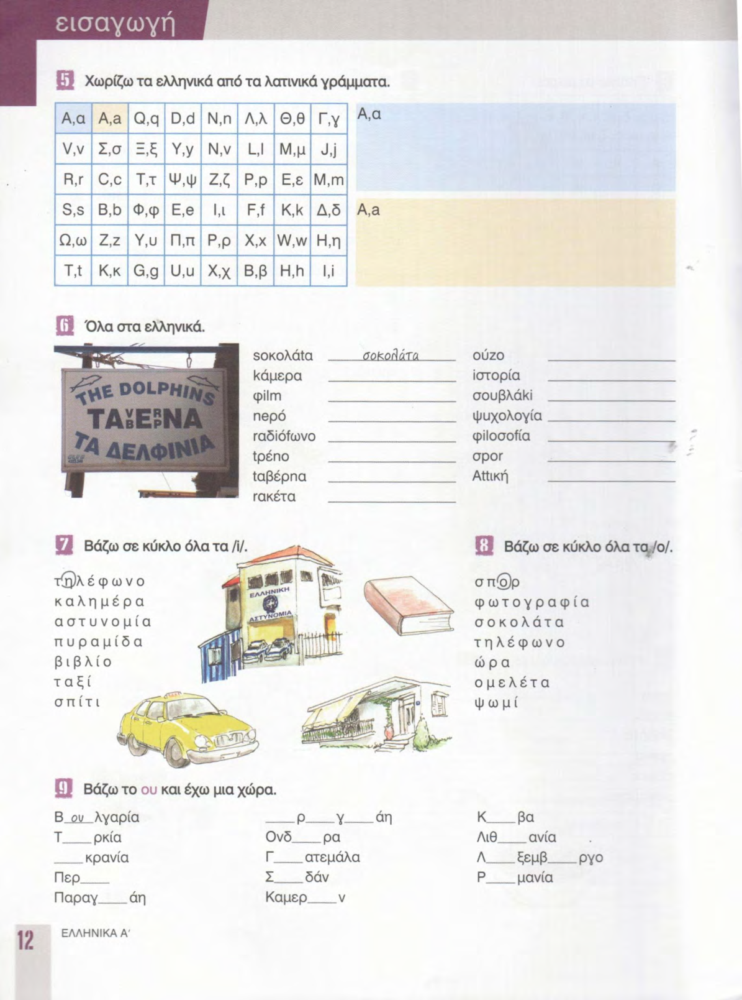
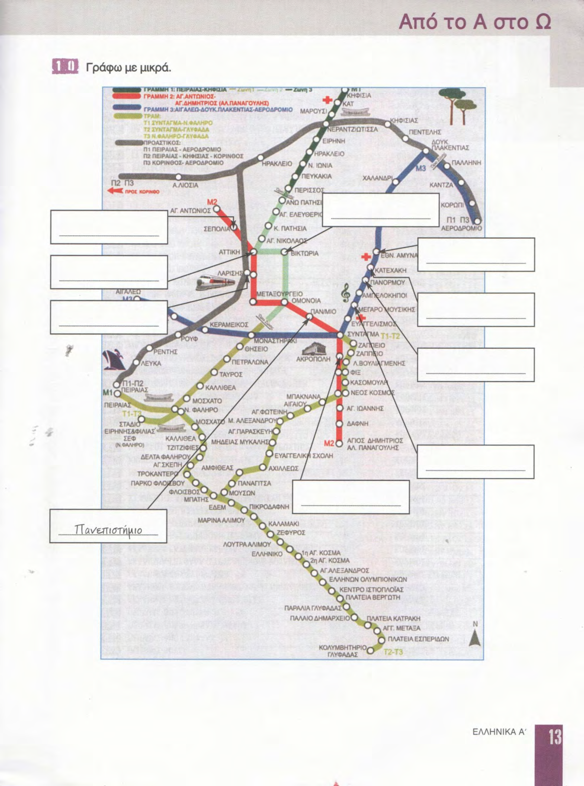

# 📚 Страницы учебника — урок 0

**[🏠 Readme](../../../Readme.md) → [📘 book/pages](../) → 📄 `content_0.md`**

*Точка входа: здесь ссылки на файл скана (`raw/*.png`) и на оцифровку (`digitized/N.md`), если она есть; при необходимости — конспект в `essence_*.md`.*

| ⚡ Быстрые ссылки |                                                          |
|------------------|----------------------------------------------------------|
| 📘 Урок (modules) | —                                                        |
| 💎 Суть урока     | [essence_0.md](essence_0.md)                             |
| 📑 Оглавление    | [К навигации по страницам](#lesson-pages-nav)            |
| 🖼 Превью        | [К превью страниц](#lesson-pages-preview)                |

## 🔢 Навигация по страницам

- **8** — [8.png](raw/8.png)
- **9** — [9.png](raw/9.png)
- **10** — [10.png](raw/10.png)
- **11** — [11.png](raw/11.png)
- **12** — [12.png](raw/12.png)
- **13** — [13.png](raw/13.png)

## 🖼 Просмотр страниц

Ниже — превью в порядке номеров страницы; перед картинкой — те же ссылки, что в навигации.

### Стр. 8

[8.png](raw/8.png)

### Стр. 9

[9.png](raw/9.png)

### Стр. 10

[10.png](raw/10.png)

### Стр. 11

[11.png](raw/11.png)

### Стр. 12

[12.png](raw/12.png)

### Стр. 13

[13.png](raw/13.png)

