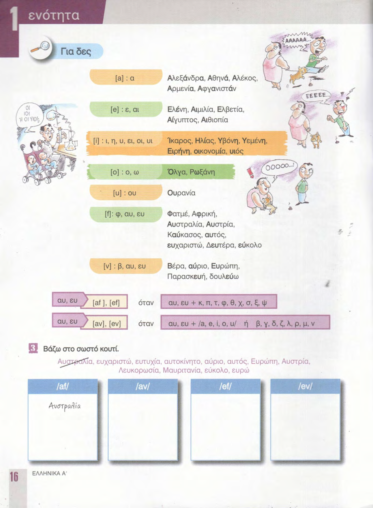
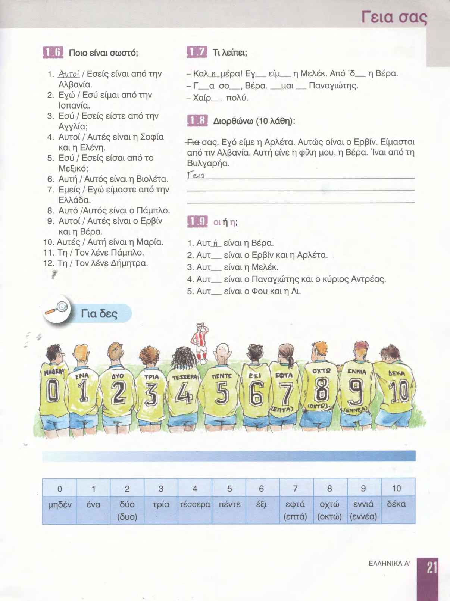

# 📚 Страницы учебника — урок 1

**[🏠 Readme](../../../Readme.md) → [📘 book/pages](../) → 📄 `content.md`**

| ⚡ Быстрые ссылки |                                                          |
|------------------|----------------------------------------------------------|
| 📘 Урок          | [lesson.md](../../../modules/lesson_1/lesson.md)         |
| 📑 Оглавление    | [К навигации](#lesson-pages-nav)                         |
| 🖼 Просмотр       | [К превью](#lesson-pages-preview)                        |

## 🔢 Навигация по страницам

- [14](14.png) · [15](15.png) · [16](16.png) · [17](17.png) · [18](18.png) · [19](19.png) · [20](20.png) · [21](21.png)
- [22](22.png) · [23](23.png)

## 🖼 Просмотр страниц

Ниже — те же файлы в порядке номеров страницы (удобно листать сверху вниз).

### Стр. 14

### Стр. 15

### Стр. 16

### Стр. 17

### Стр. 18

### Стр. 19

### Стр. 20

### Стр. 21

### Стр. 22

### Стр. 23

