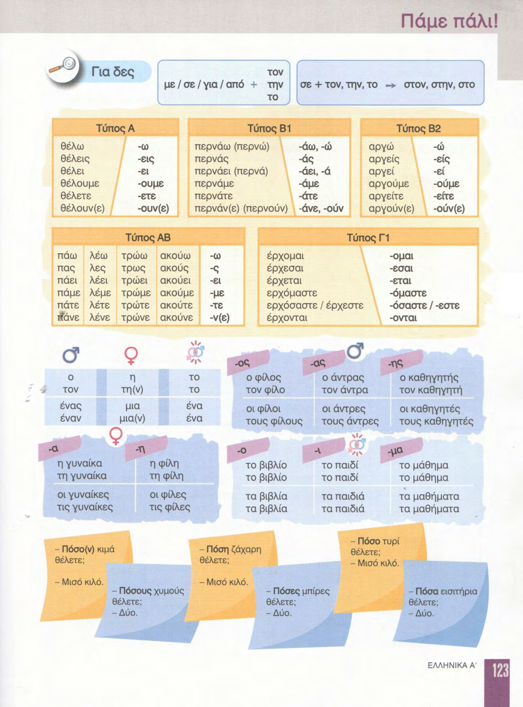
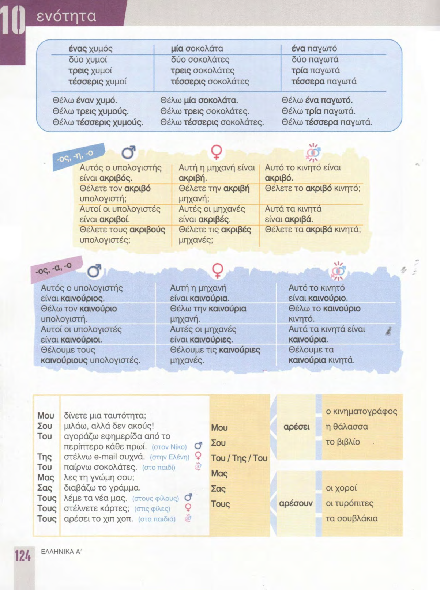
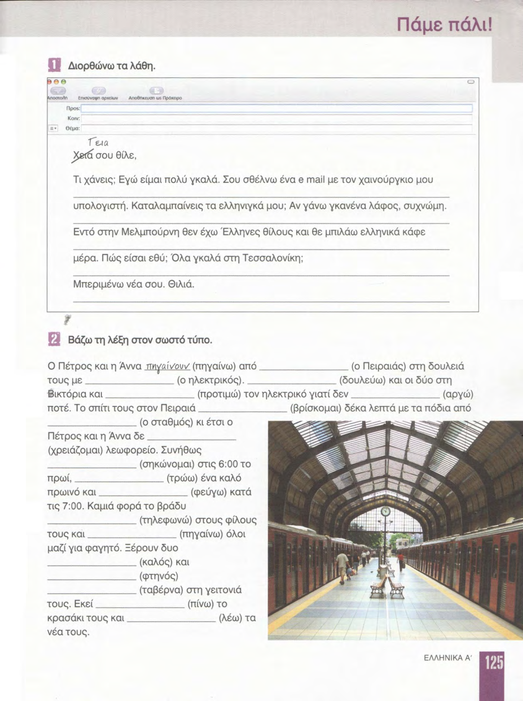
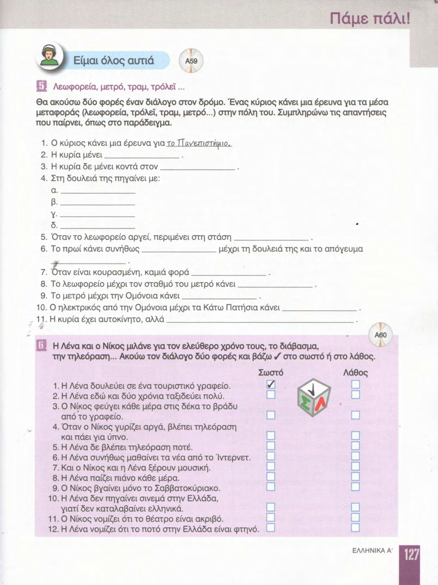
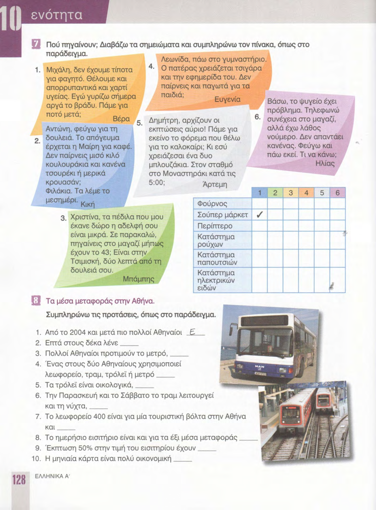

# 📚 Страницы учебника — урок 10

**[🏠 Readme](../../../Readme.md) → [📘 book/pages](../) → 📄 `content.md`**

| ⚡ Быстрые ссылки |                                                          |
|------------------|----------------------------------------------------------|
| 📘 Урок          | —                                                        |
| 📑 Оглавление    | [К навигации](#lesson-pages-nav)                         |
| 🖼 Просмотр       | [К превью](#lesson-pages-preview)                        |

## 🔢 Навигация по страницам

- [122](122.png) · [123](123.png) · [124](124.png) · [125](125.png) · [126](126.png) · [127](127.png) · [128](128.png) · [129](129.png)
- [130](130.png) · [131](131.png)

## 🖼 Просмотр страниц

Ниже — те же файлы в порядке номеров страницы (удобно листать сверху вниз).

### Стр. 122

### Стр. 123

### Стр. 124

### Стр. 125

### Стр. 126

### Стр. 127

### Стр. 128

### Стр. 129

### Стр. 130

### Стр. 131

