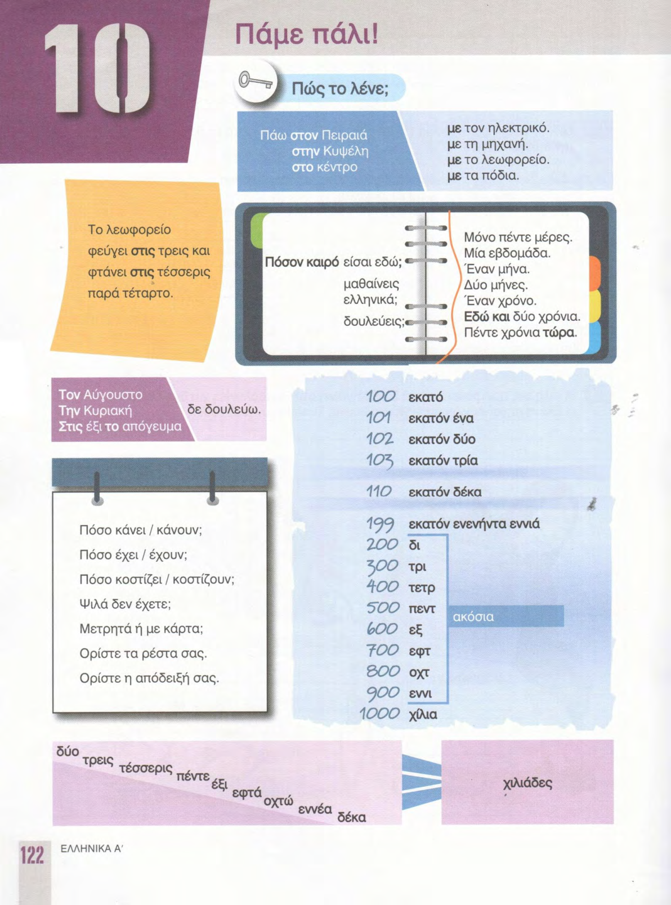
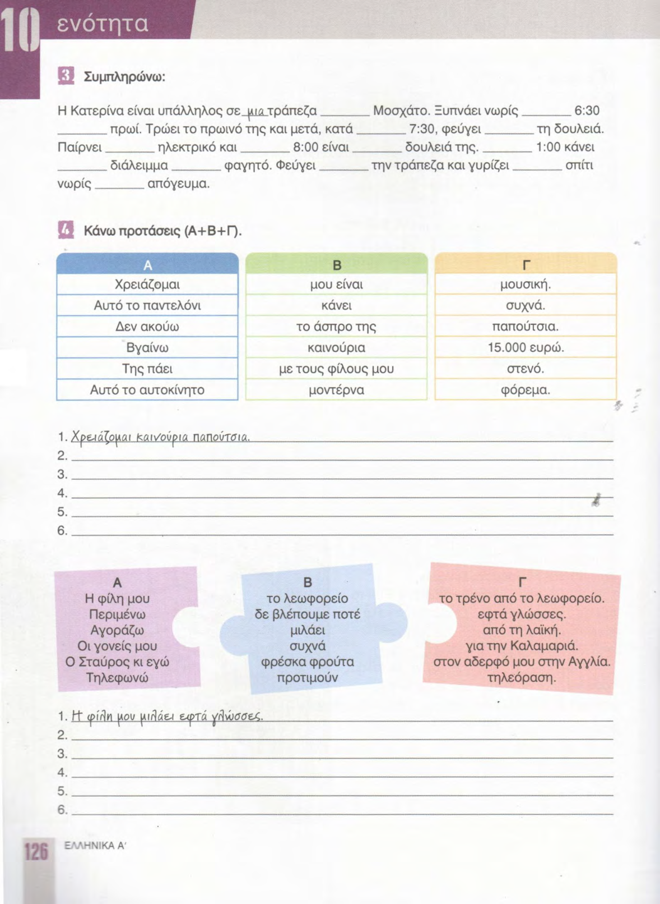
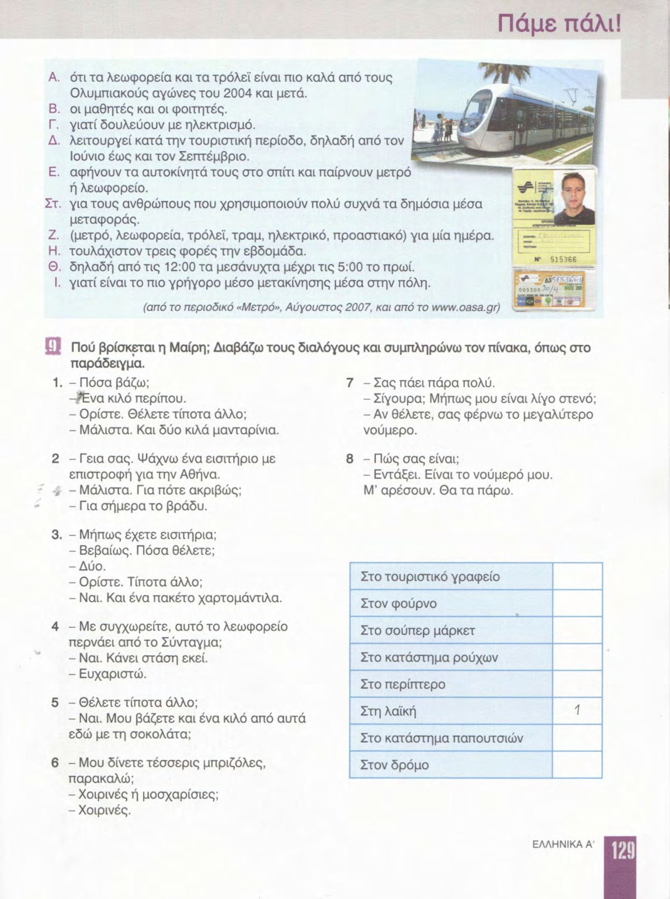
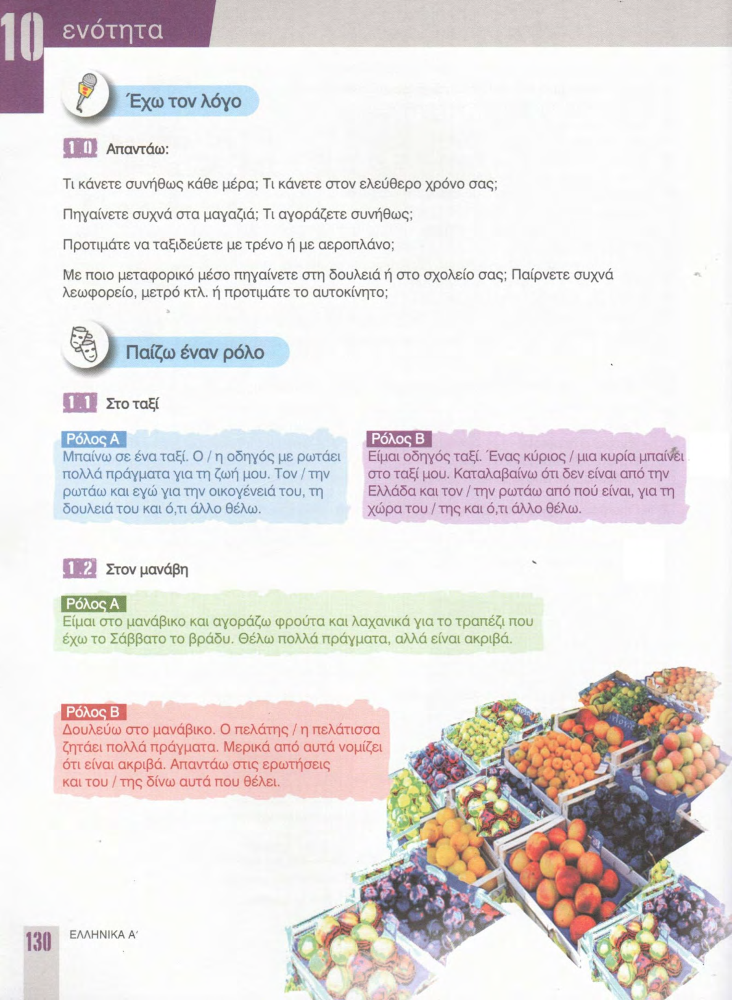

# 📚 Страницы учебника — урок 10

**[🏠 Readme](../../../Readme.md) → [📘 book/pages](../) → 📄 `content_10.md`**

*Точка входа: здесь ссылки на файл скана (`raw/*.png`) и на оцифровку (`digitized/N.md`), если она есть.*

| ⚡ Быстрые ссылки |                                                          |
|------------------|----------------------------------------------------------|
| 📘 Урок (modules) | —                                                        |
| 📑 Оглавление    | [К навигации по страницам](#lesson-pages-nav)            |
| 🖼 Превью        | [К превью страниц](#lesson-pages-preview)                |

## 🔢 Навигация по страницам

- **122** — [122.png](raw/122.png) · [122.md](digitized/122.md)
- **123** — [123.png](raw/123.png) · [123.md](digitized/123.md)
- **124** — [124.png](raw/124.png) · [124.md](digitized/124.md)
- **125** — [125.png](raw/125.png)
- **126** — [126.png](raw/126.png)
- **127** — [127.png](raw/127.png)
- **128** — [128.png](raw/128.png)
- **129** — [129.png](raw/129.png)
- **130** — [130.png](raw/130.png)
- **131** — [131.png](raw/131.png)

## 🖼 Просмотр страниц

Ниже — превью в порядке номеров страницы; перед картинкой — те же ссылки, что в навигации.

### Стр. 122

[122.png](raw/122.png) · [122.md](digitized/122.md)

### Стр. 123

[123.png](raw/123.png) · [123.md](digitized/123.md)

### Стр. 124

[124.png](raw/124.png) · [124.md](digitized/124.md)

### Стр. 125

[125.png](raw/125.png)

### Стр. 126

[126.png](raw/126.png)

### Стр. 127

[127.png](raw/127.png)

### Стр. 128

[128.png](raw/128.png)

### Стр. 129

[129.png](raw/129.png)

### Стр. 130

[130.png](raw/130.png)

### Стр. 131

[131.png](raw/131.png)

