# 📚 Страницы учебника — урок 15

**[🏠 Readme](../../../Readme.md) → [📘 book/pages](../) → 📄 `content.md`**

| ⚡ Быстрые ссылки |                                                          |
|------------------|----------------------------------------------------------|
| 📘 Урок          | —                                                        |
| 📁 Исходники     | [raw/](raw/)                                             |
| ✨ Оцифровка     | [digitized/](digitized/)                                 |
| 📑 Оглавление    | [К навигации](#lesson-pages-nav)                         |
| 🖼 Просмотр       | [К превью](#lesson-pages-preview)                        |

## 🔢 Навигация по страницам

- [200](raw/200.png) · [201](raw/201.png) · [202](raw/202.png) · [203](raw/203.png) · [204](raw/204.png) · [205](raw/205.png) · [206](raw/206.png) · [207](raw/207.png)
- [208](raw/208.png) · [209](raw/209.png) · [210](raw/210.png) · [211](raw/211.png)

## 🖼 Просмотр страниц

Ниже — те же файлы из `raw/` в порядке номеров страницы (удобно листать сверху вниз).

### Стр. 200

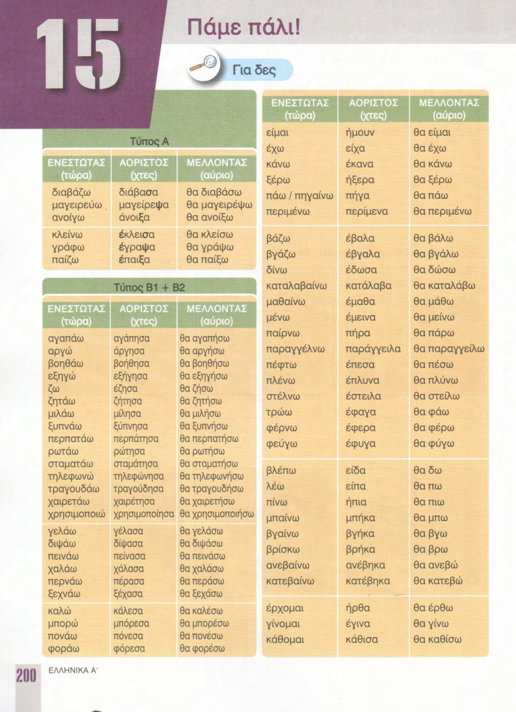

### Стр. 201

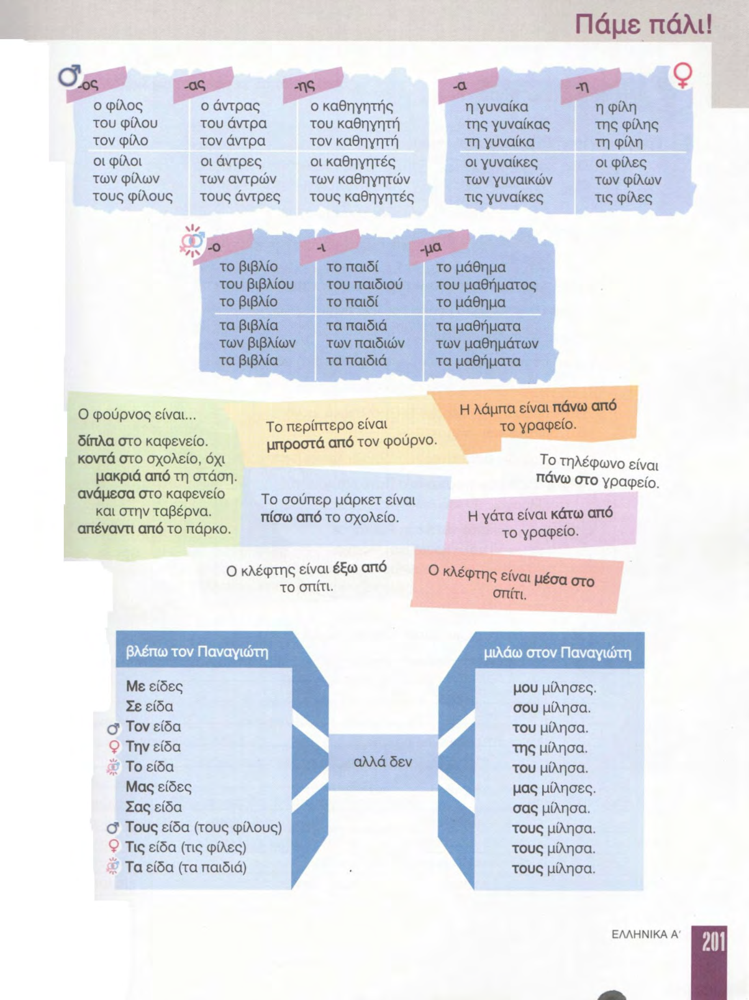

### Стр. 202

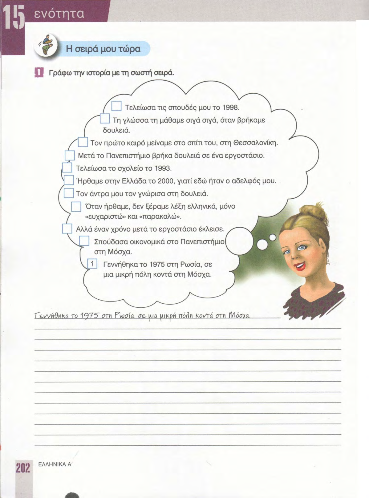

### Стр. 203

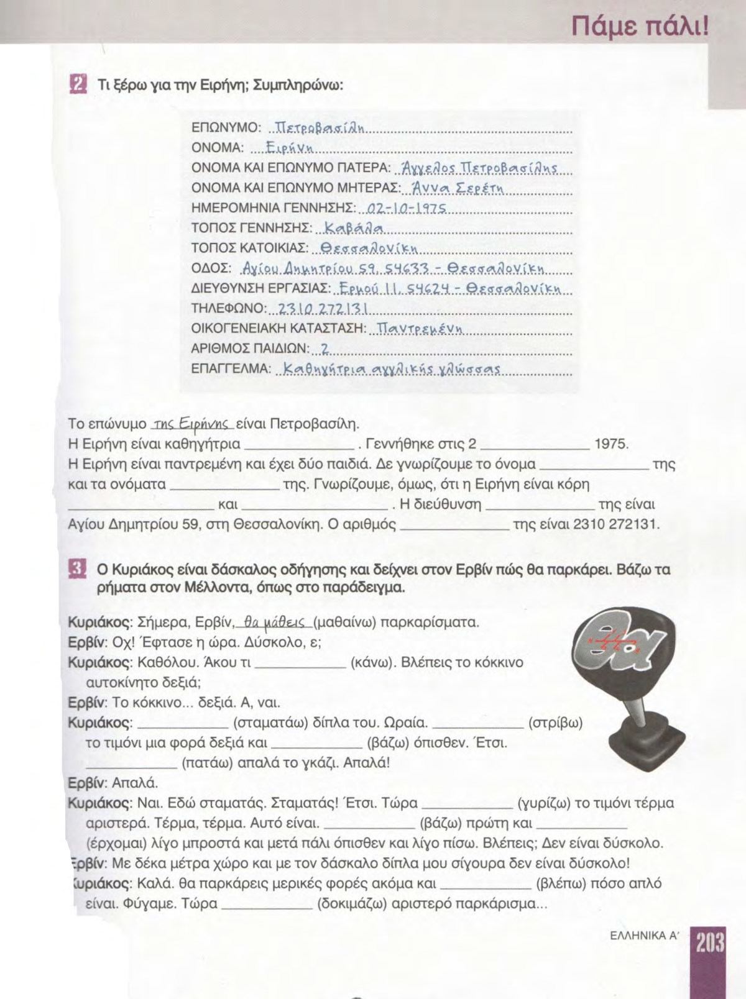

### Стр. 204

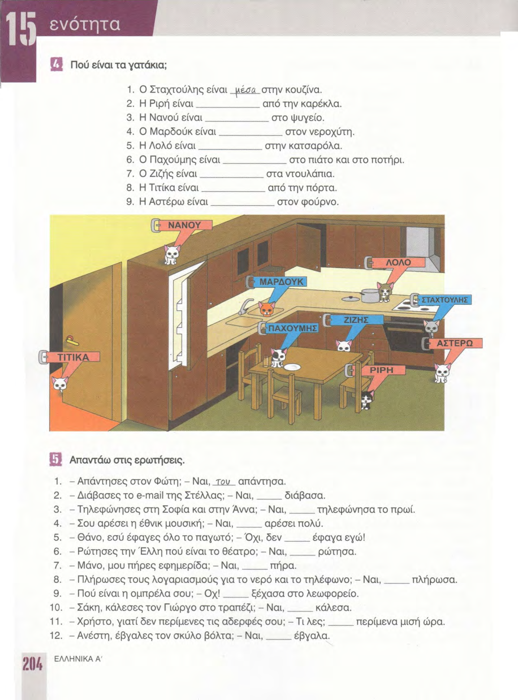

### Стр. 205

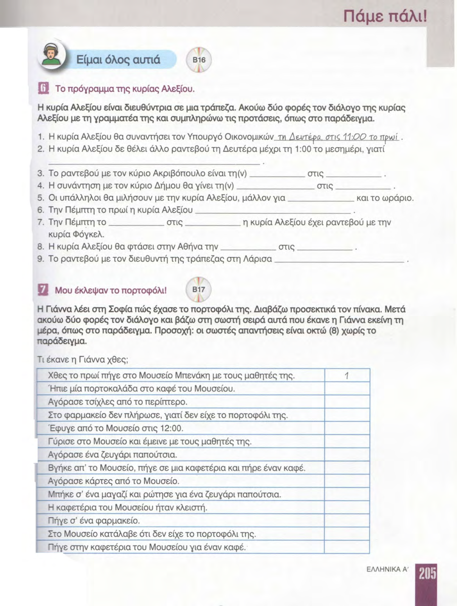

### Стр. 206

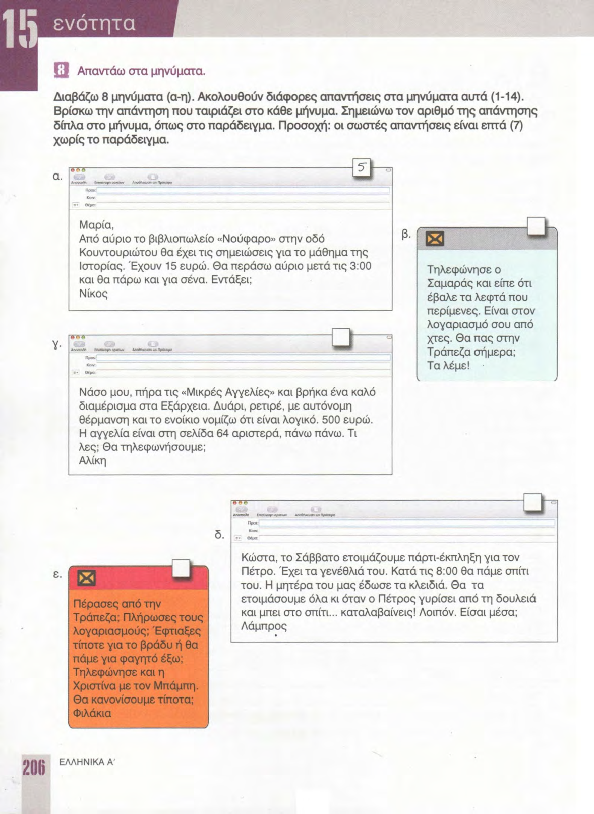

### Стр. 207

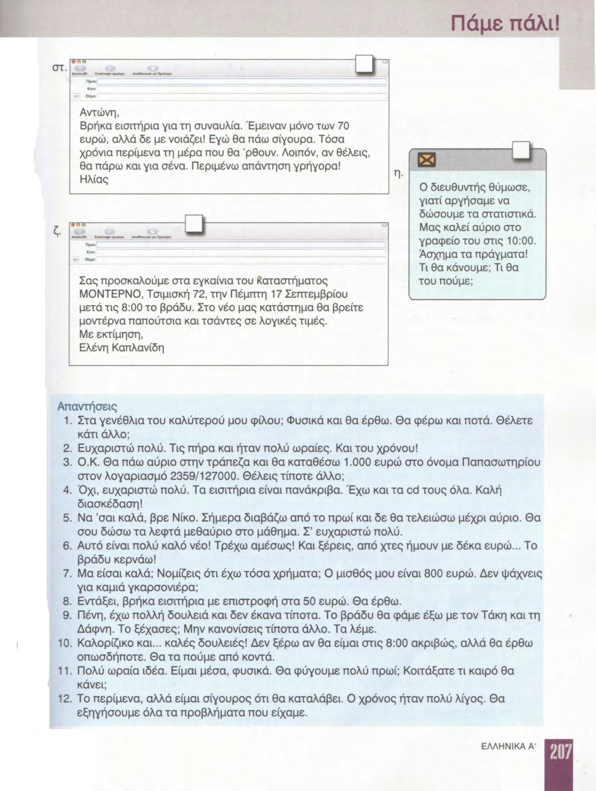

### Стр. 208

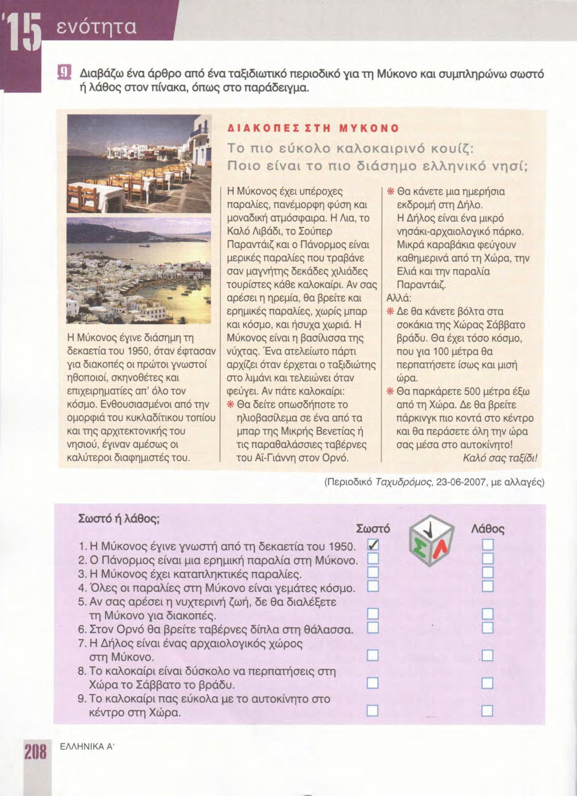

### Стр. 209

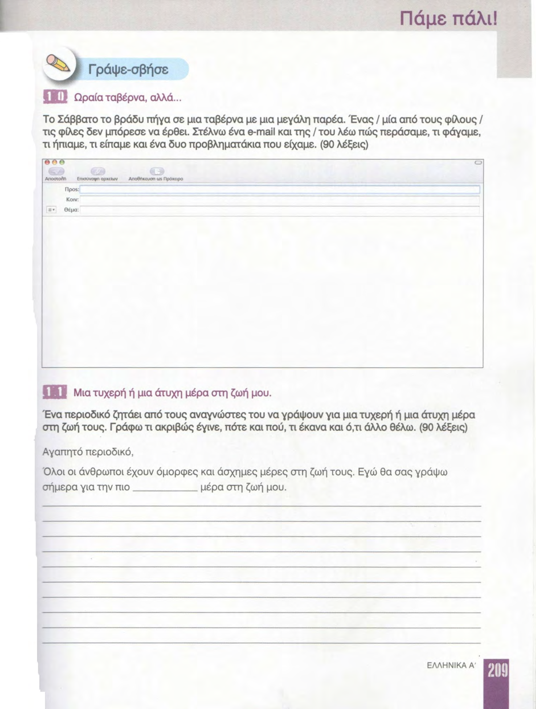

### Стр. 210

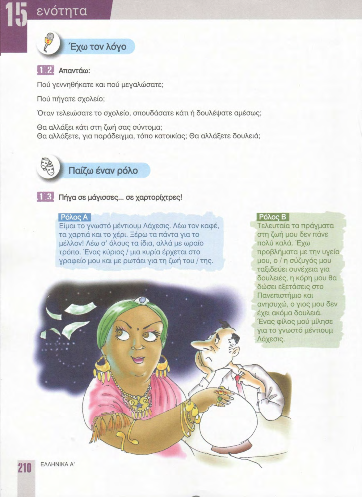

### Стр. 211

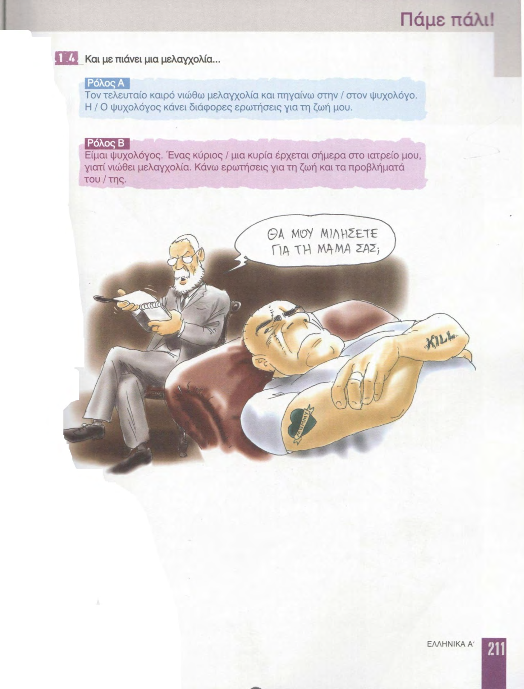
