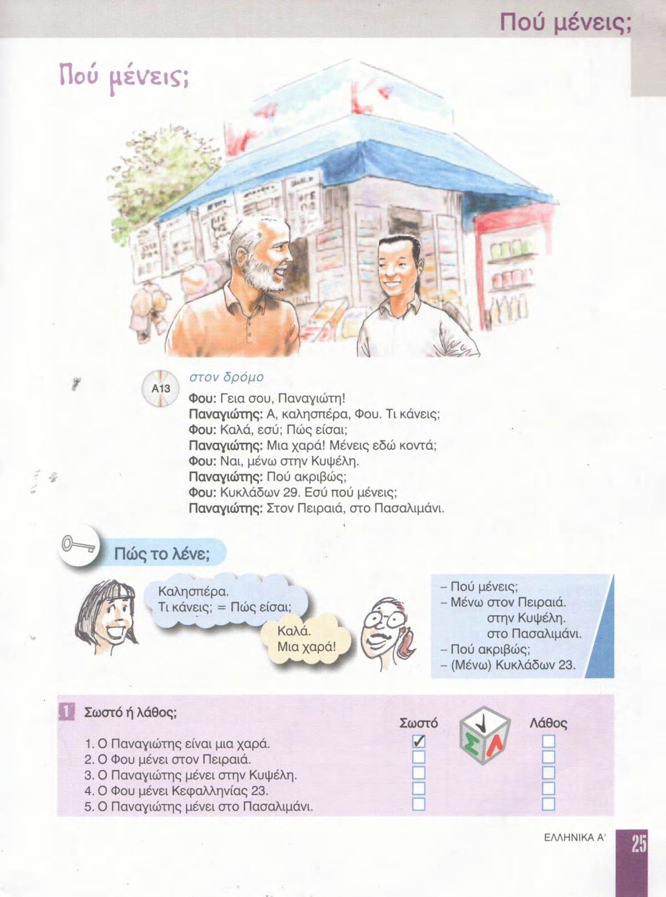
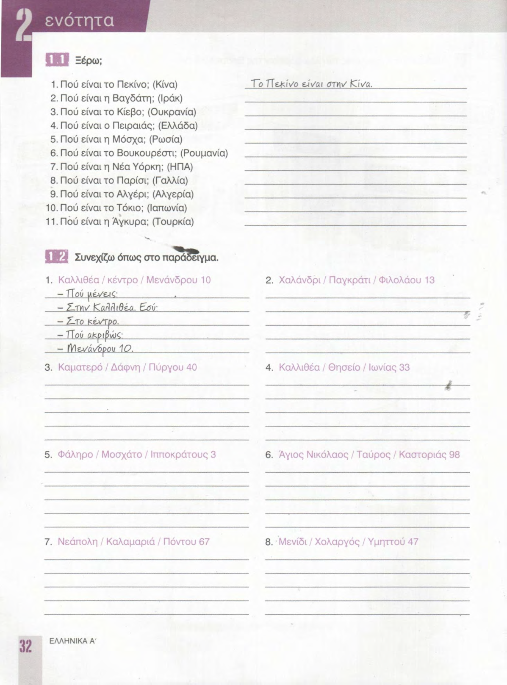
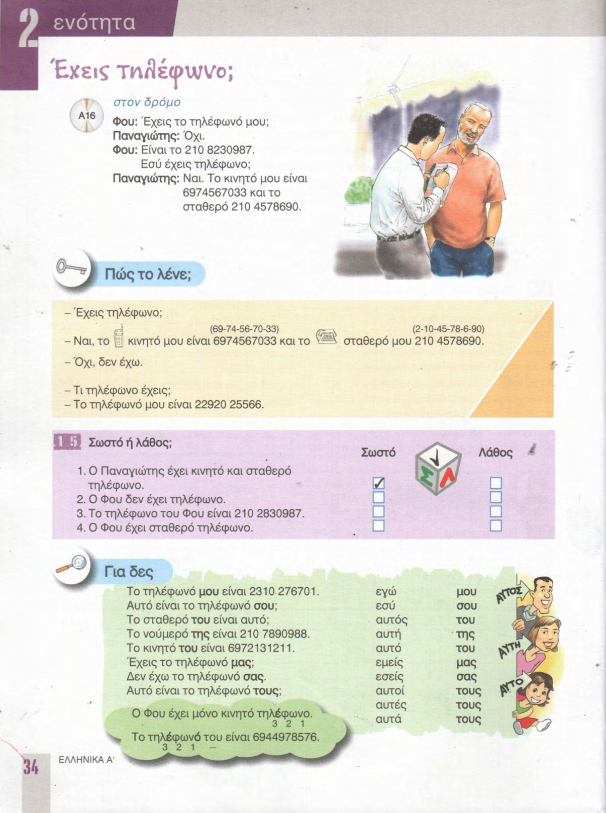
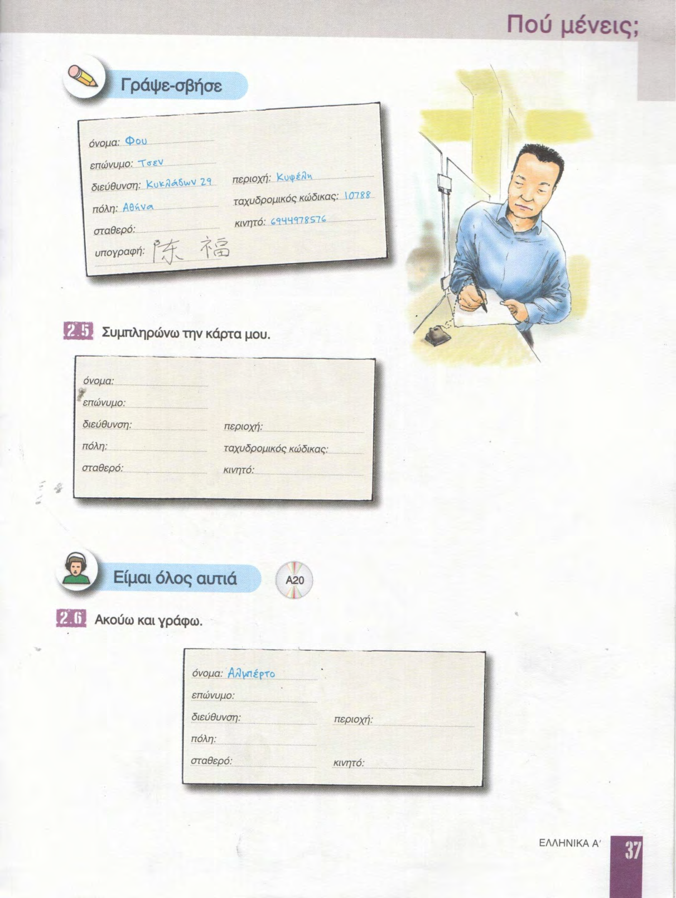

# 📚 Страницы учебника — урок 2

**[🏠 Readme](../../../Readme.md) → [📘 book/pages](../) → 📄 `content.md`**

| ⚡ Быстрые ссылки |                                                          |
|------------------|----------------------------------------------------------|
| 📘 Урок          | [lesson.md](../../../modules/lesson_2/lesson.md)         |
| 📑 Оглавление    | [К навигации](#lesson-pages-nav)                         |
| 🖼 Просмотр       | [К превью](#lesson-pages-preview)                        |

## 🔢 Навигация по страницам

- [24](24.png) · [25](25.png) · [26](26.png) · [27](27.png) · [28](28.png) · [29](29.png) · [30](30.png) · [31](31.png)
- [32](32.png) · [33](33.png) · [34](34.png) · [35](35.png) · [36](36.png) · [37](37.png)

## 🖼 Просмотр страниц

Ниже — те же файлы в порядке номеров страницы (удобно листать сверху вниз).

### Стр. 24

### Стр. 25

### Стр. 26

### Стр. 27

### Стр. 28

### Стр. 29

### Стр. 30

### Стр. 31

### Стр. 32

### Стр. 33

### Стр. 34

### Стр. 35

### Стр. 36

### Стр. 37

