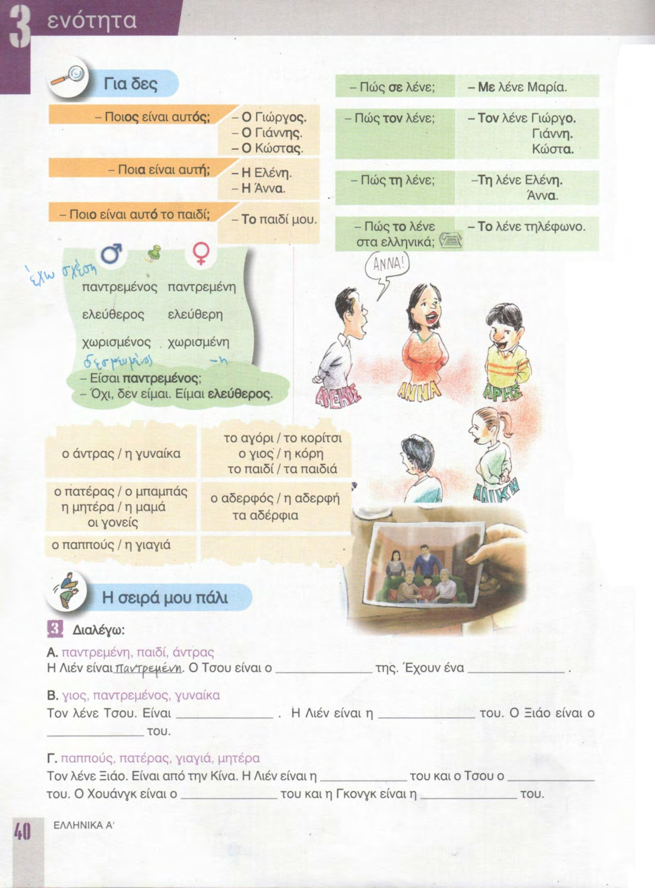
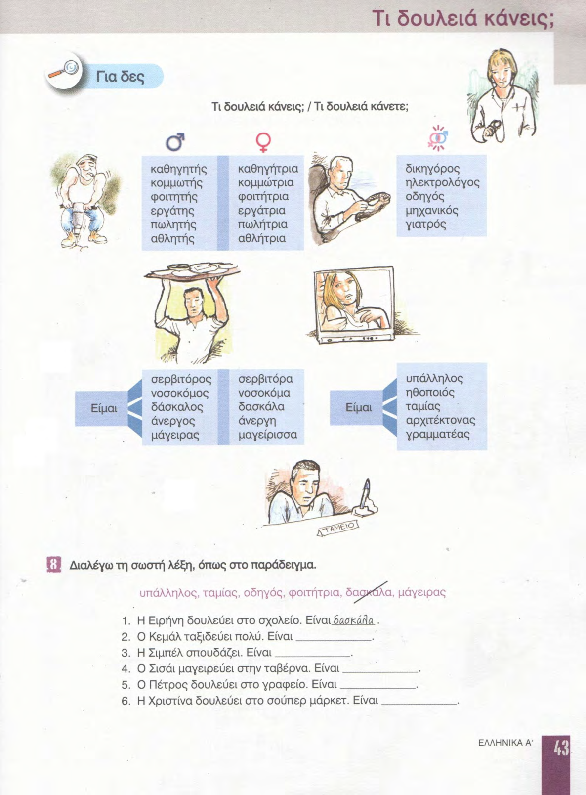
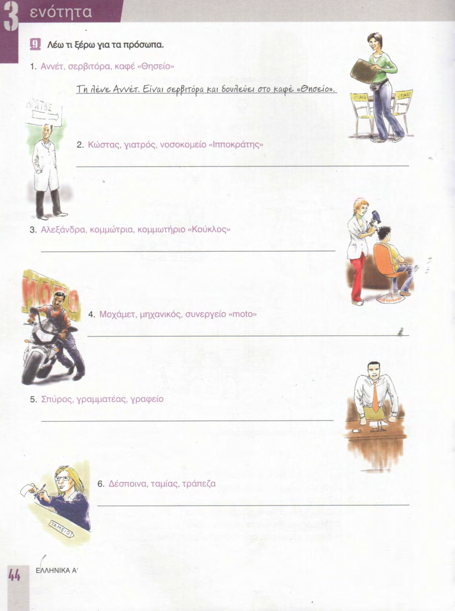
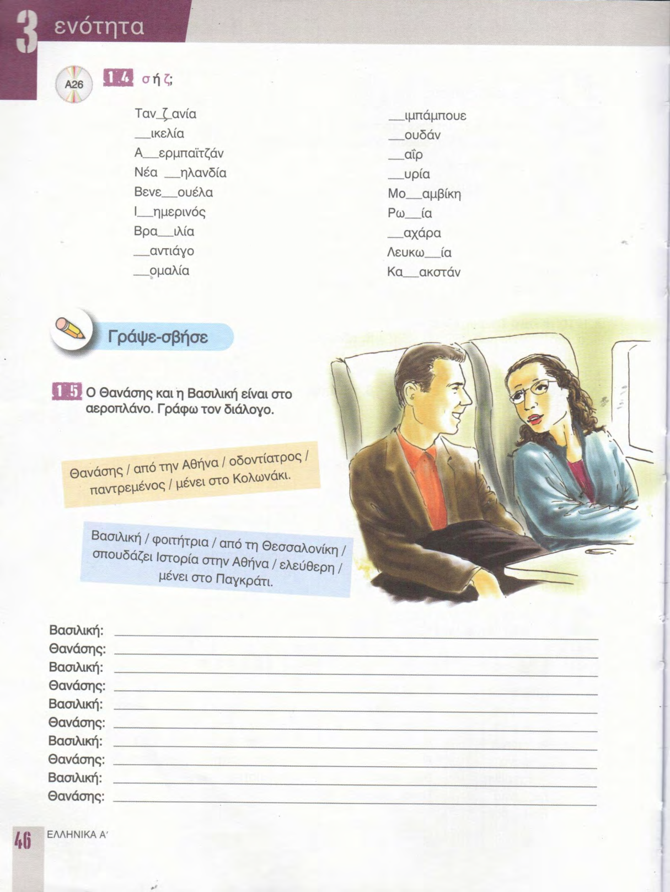
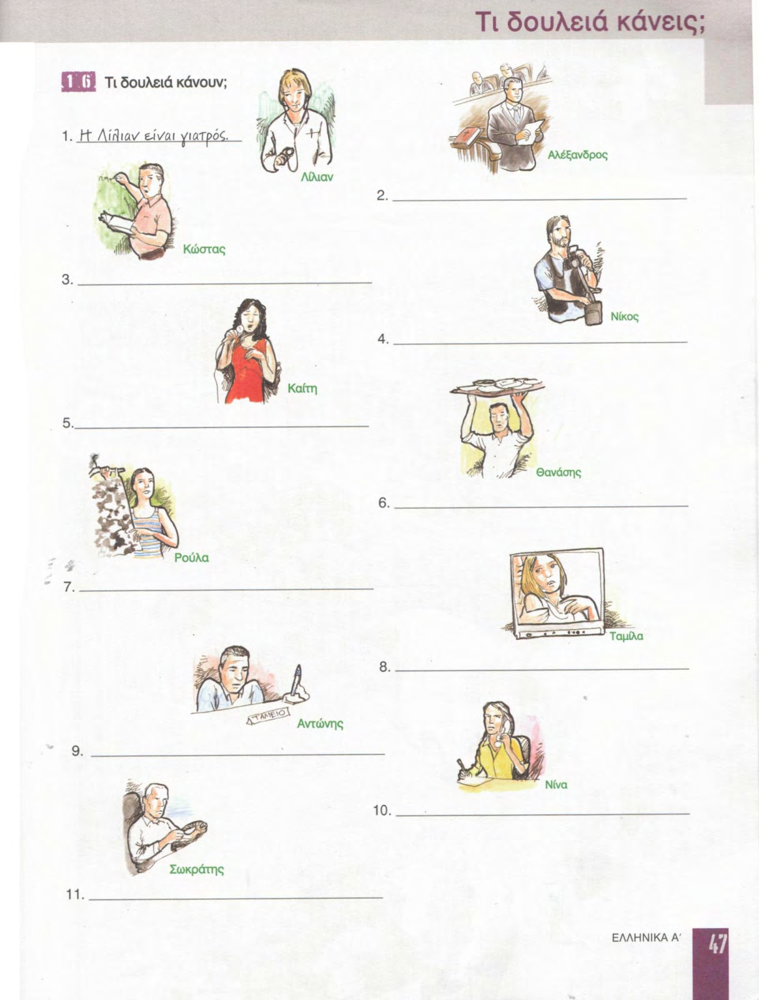

# 📚 Страницы учебника — урок 3

**[🏠 Readme](../../../Readme.md) → [📘 book/pages](../) → 📄 `content.md`**

| ⚡ Быстрые ссылки |                                                          |
|------------------|----------------------------------------------------------|
| 📘 Урок          | [lesson.md](../../../modules/lesson_3/lesson.md)         |
| 📑 Оглавление    | [К навигации](#lesson-pages-nav)                         |
| 🖼 Просмотр       | [К превью](#lesson-pages-preview)                        |

## 🔢 Навигация по страницам

- [38](38.png) · [39](39.png) · [40](40.png) · [41](41.png) · [42](42.png) · [43](43.png) · [44](44.png) · [45](45.png)
- [46](46.png) · [47](47.png)

## 🖼 Просмотр страниц

Ниже — те же файлы в порядке номеров страницы (удобно листать сверху вниз).

### Стр. 38

### Стр. 39

### Стр. 40

### Стр. 41

### Стр. 42

### Стр. 43

### Стр. 44

### Стр. 45

### Стр. 46

### Стр. 47

