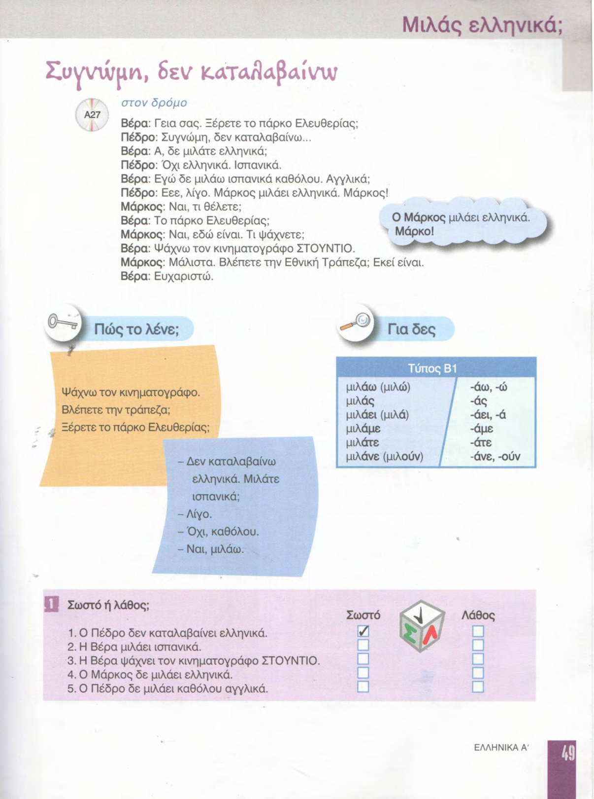
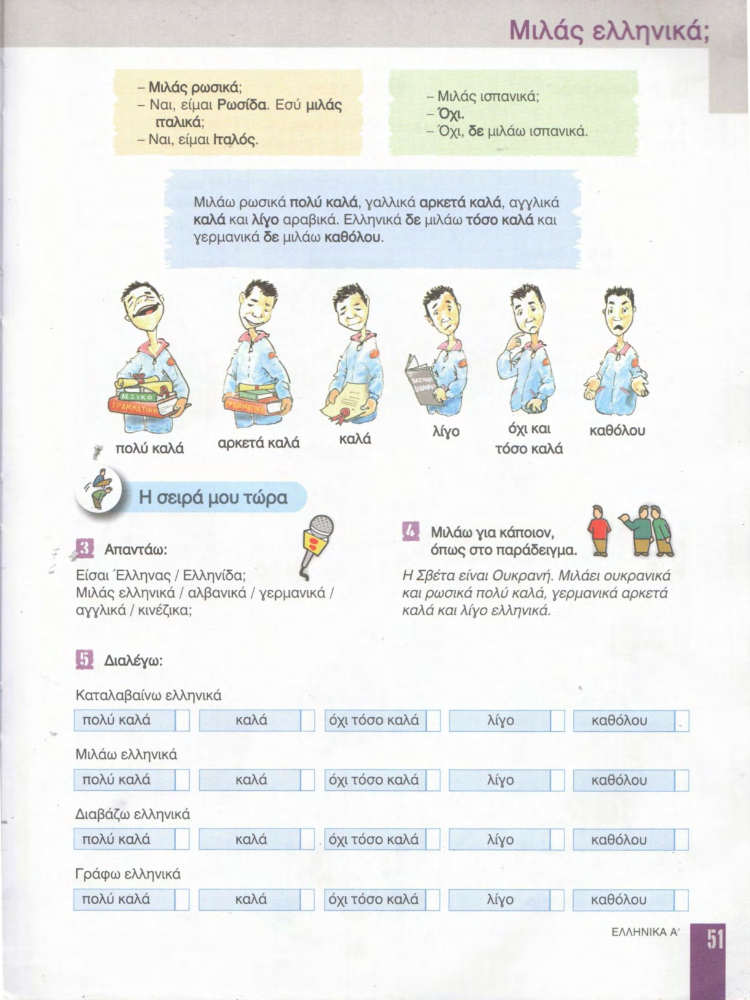
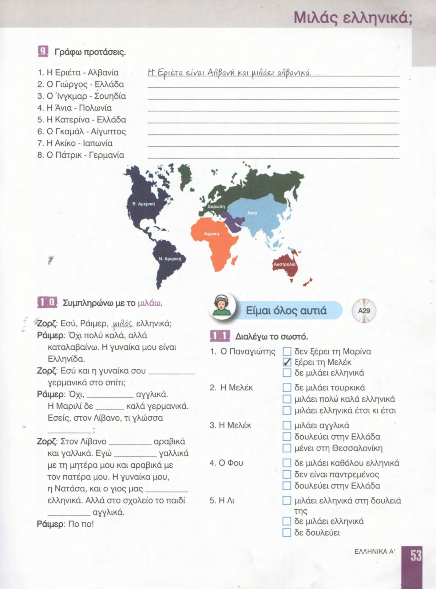

# 📚 Страницы учебника — урок 4

**[🏠 Readme](../../../Readme.md) → [📘 book/pages](../) → 📄 `content.md`**

| ⚡ Быстрые ссылки |                                                          |
|------------------|----------------------------------------------------------|
| 📘 Урок          | [lesson.md](../../../modules/lesson_4/lesson.md)         |
| 📑 Оглавление    | [К навигации](#lesson-pages-nav)                         |
| 🖼 Просмотр       | [К превью](#lesson-pages-preview)                        |

## 🔢 Навигация по страницам

- [48](48.png) · [49](49.png) · [50](50.png) · [51](51.png) · [52](52.png) · [53](53.png) · [54](54.png) · [55](55.png)
- [56](56.png) · [57](57.png) · [58](58.png)

## 🖼 Просмотр страниц

Ниже — те же файлы в порядке номеров страницы (удобно листать сверху вниз).

### Стр. 48

### Стр. 49

### Стр. 50

### Стр. 51

### Стр. 52

### Стр. 53

### Стр. 54

### Стр. 55

### Стр. 56

### Стр. 57

### Стр. 58

