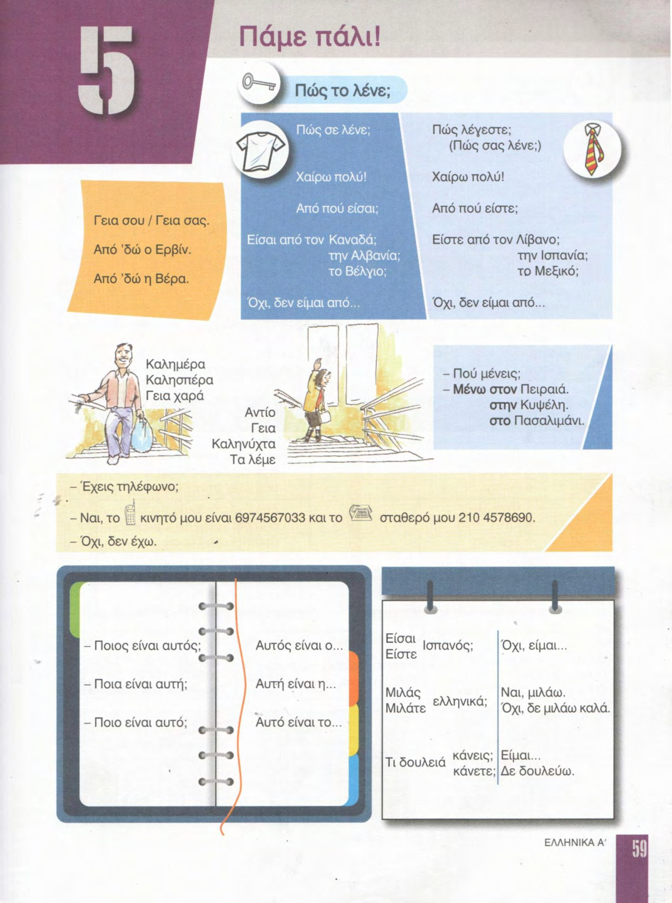
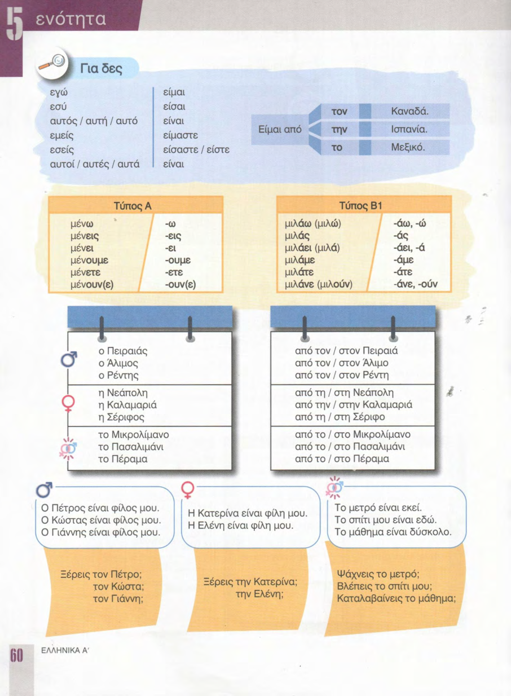
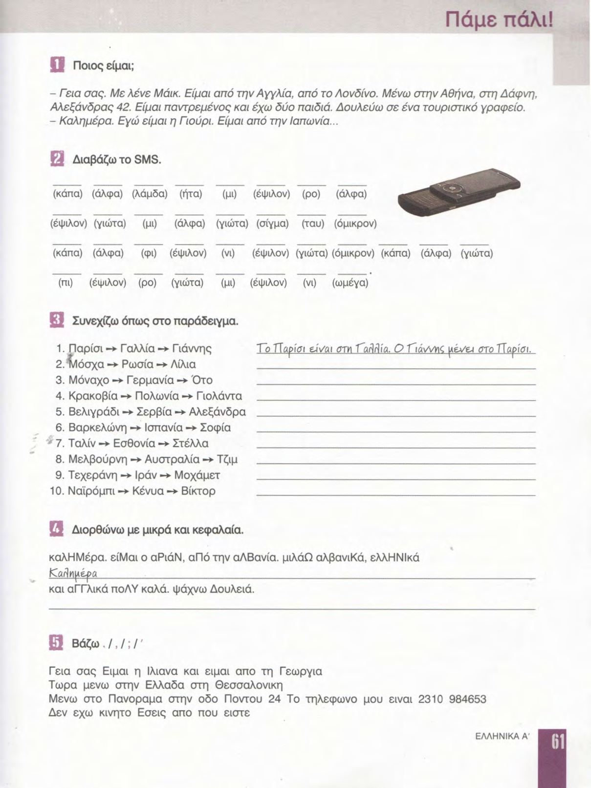
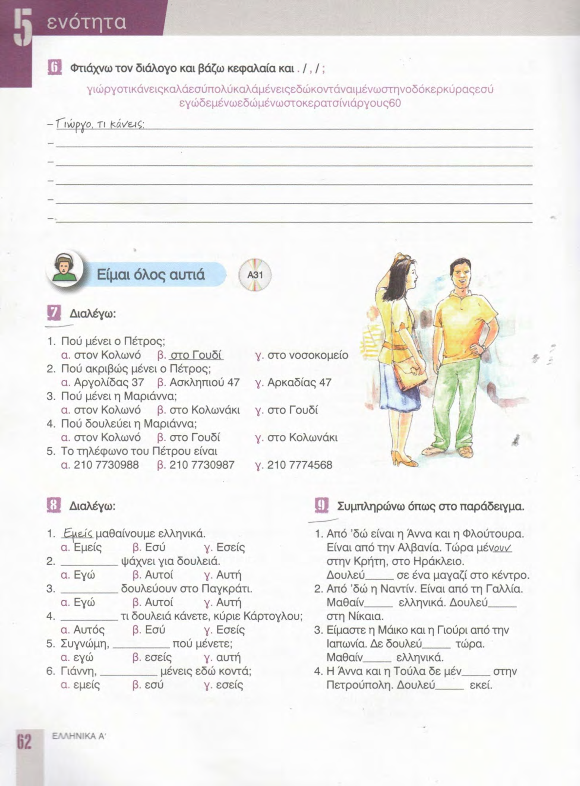
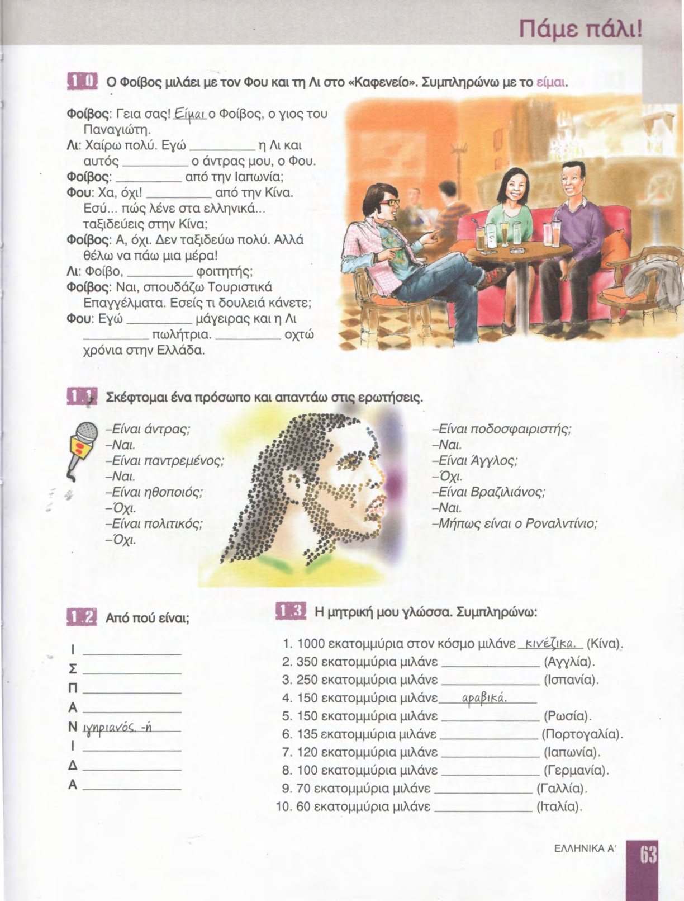
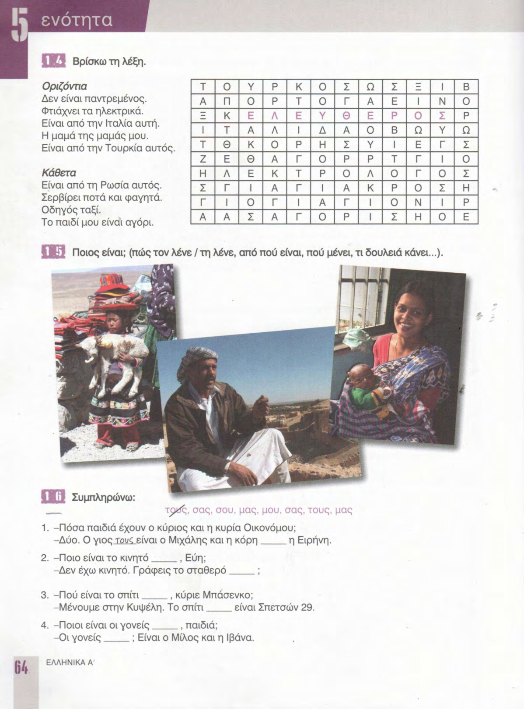
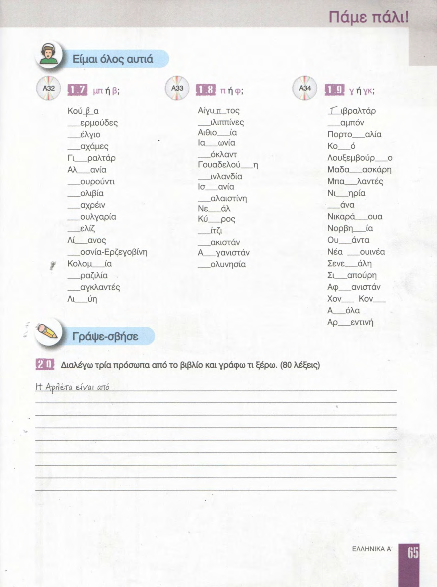

# 📚 Страницы учебника — урок 5

**[🏠 Readme](../../../Readme.md) → [📘 book/pages](../) → 📄 `content.md`**

| ⚡ Быстрые ссылки |                                                          |
|------------------|----------------------------------------------------------|
| 📘 Урок          | —                                                        |
| 📁 Исходники     | [raw/](raw/)                                             |
| ✨ Оцифровка     | [digitized/](digitized/)                                 |
| 📑 Оглавление    | [К навигации](#lesson-pages-nav)                         |
| 🖼 Просмотр       | [К превью](#lesson-pages-preview)                        |

## 🔢 Навигация по страницам

- [59](raw/59.png) · [60](raw/60.png) · [61](raw/61.png) · [62](raw/62.png) · [63](raw/63.png) · [64](raw/64.png) · [65](raw/65.png)

## 🖼 Просмотр страниц

Ниже — те же файлы из `raw/` в порядке номеров страницы (удобно листать сверху вниз).

### Стр. 59

### Стр. 60

### Стр. 61

### Стр. 62

### Стр. 63

### Стр. 64

### Стр. 65

