# 📚 Страницы учебника — урок 6

**[🏠 Readme](../../../Readme.md) → [📘 book/pages](../) → 📄 `content_6.md`**

*Точка входа: здесь ссылки на файл скана (`raw/*.png`) и на оцифровку (`digitized/N.md`), если она есть.*

| ⚡ Быстрые ссылки |                                                          |
|------------------|----------------------------------------------------------|
| 📘 Урок (modules) | —                                                        |
| 📑 Оглавление    | [К навигации по страницам](#lesson-pages-nav)            |
| 🖼 Превью        | [К превью страниц](#lesson-pages-preview)                |

## 🔢 Навигация по страницам

- **66** — [66.png](raw/66.png)
- **67** — [67.png](raw/67.png)
- **68** — [68.png](raw/68.png)
- **69** — [69.png](raw/69.png)
- **70** — [70.png](raw/70.png)
- **71** — [71.png](raw/71.png)
- **72** — [72.png](raw/72.png)
- **73** — [73.png](raw/73.png)
- **74** — [74.png](raw/74.png)
- **75** — [75.png](raw/75.png)
- **76** — [76.png](raw/76.png)
- **77** — [77.png](raw/77.png)
- **78** — [78.png](raw/78.png)
- **79** — [79.png](raw/79.png)

## 🖼 Просмотр страниц

Ниже — превью в порядке номеров страницы; перед картинкой — те же ссылки, что в навигации.

### Стр. 66

[66.png](raw/66.png)

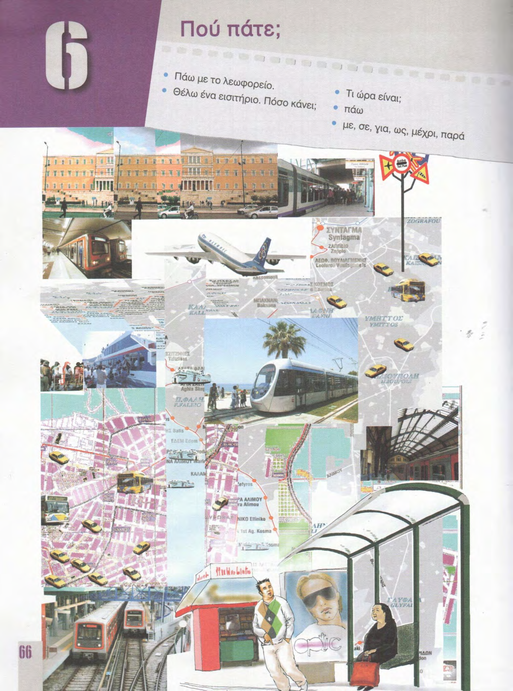

### Стр. 67

[67.png](raw/67.png)

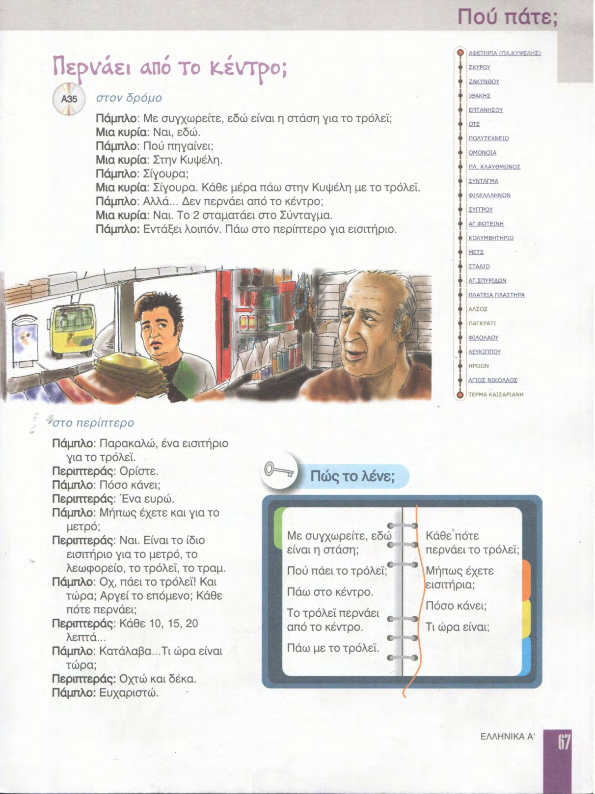

### Стр. 68

[68.png](raw/68.png)

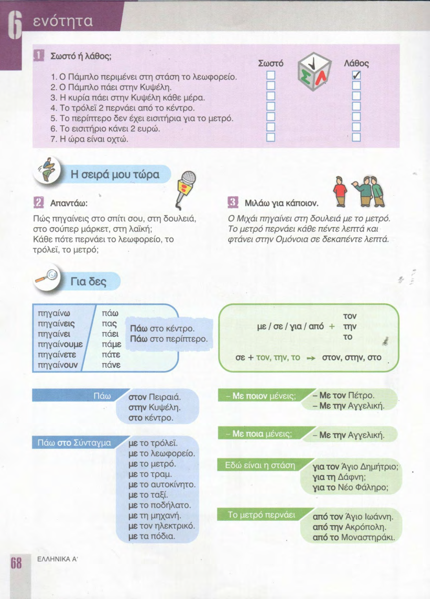

### Стр. 69

[69.png](raw/69.png)

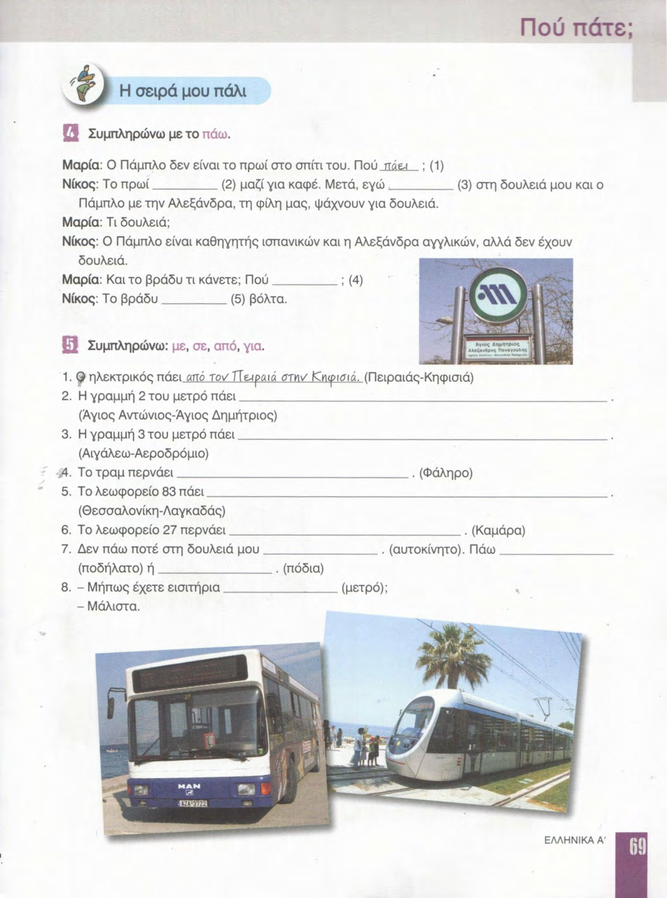

### Стр. 70

[70.png](raw/70.png)

### Стр. 71

[71.png](raw/71.png)

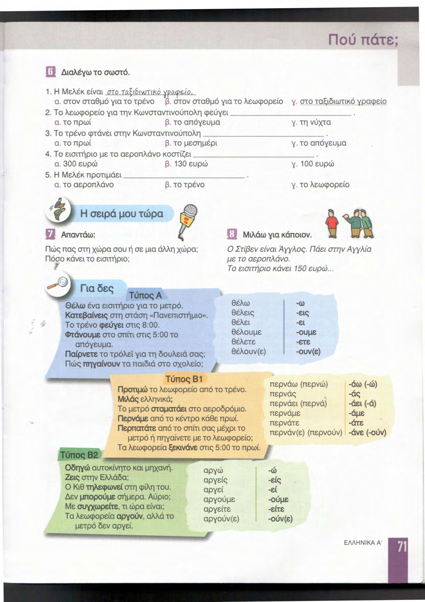

### Стр. 72

[72.png](raw/72.png)

### Стр. 73

[73.png](raw/73.png)

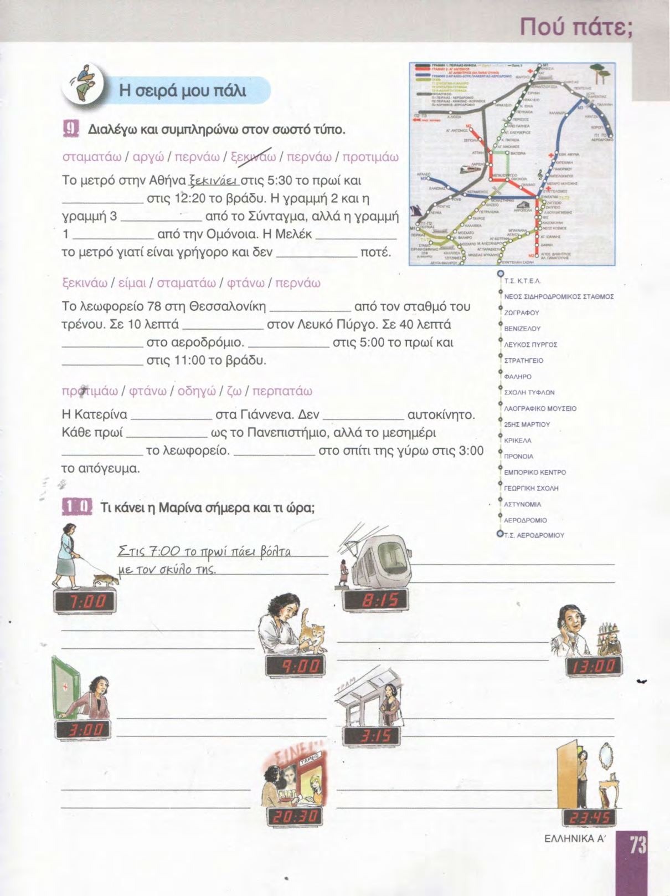

### Стр. 74

[74.png](raw/74.png)

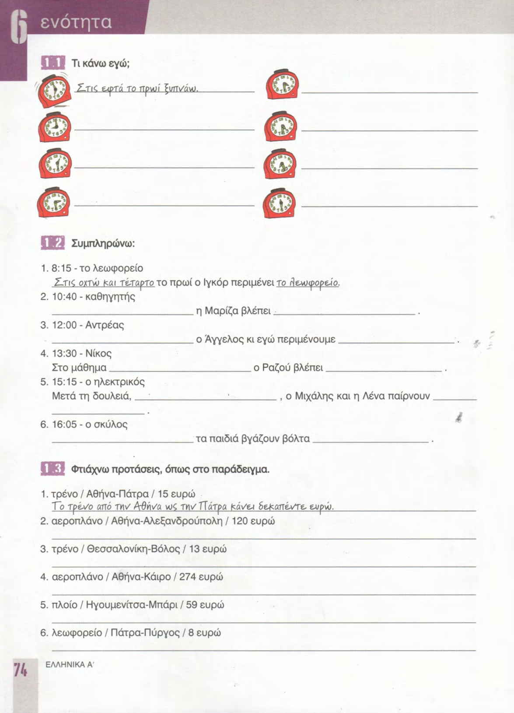

### Стр. 75

[75.png](raw/75.png)

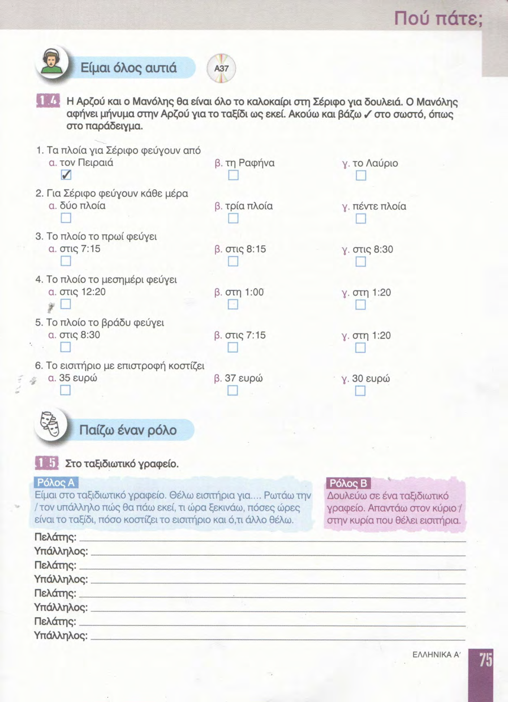

### Стр. 76

[76.png](raw/76.png)

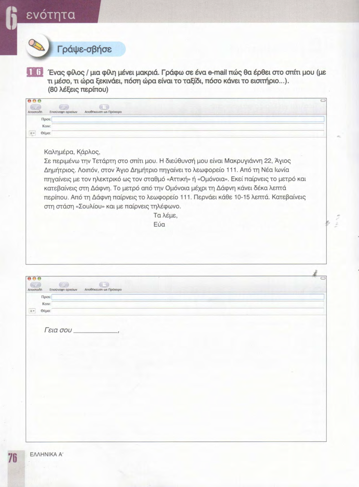

### Стр. 77

[77.png](raw/77.png)

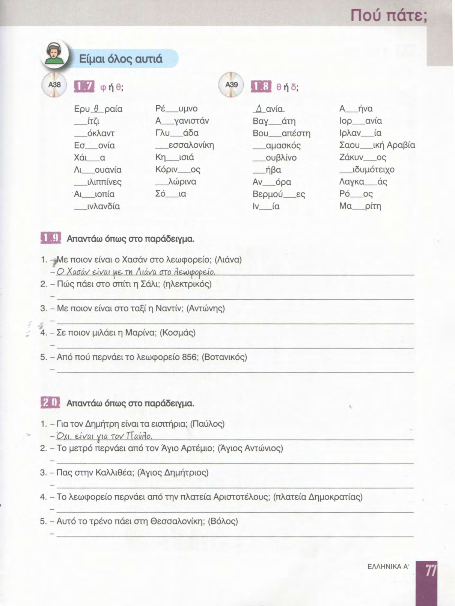

### Стр. 78

[78.png](raw/78.png)

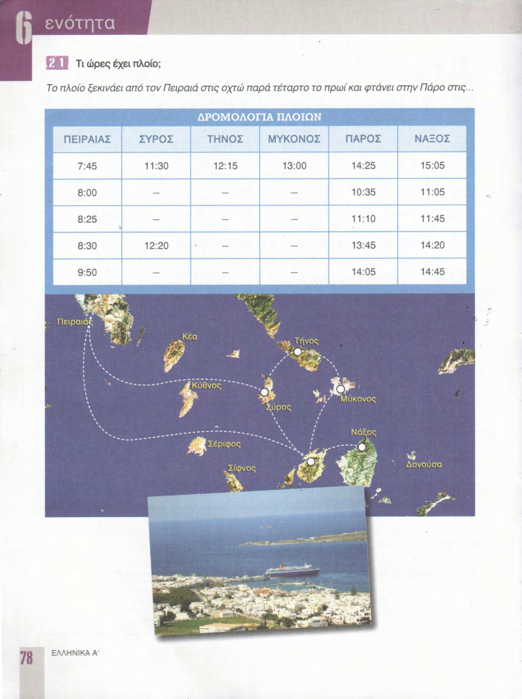

### Стр. 79

[79.png](raw/79.png)

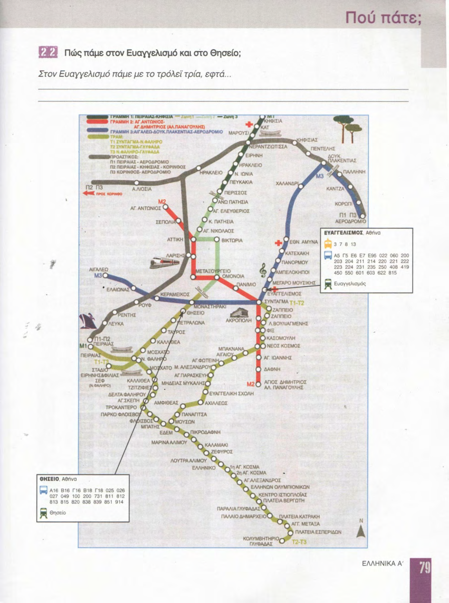
