# 📚 Страницы учебника — урок 7

**[🏠 Readme](../../../Readme.md) → [📘 book/pages](../) → 📄 `content_7.md`**

*Точка входа: здесь ссылки на файл скана (`raw/*.png`) и на оцифровку (`digitized/N.md`), если она есть.*

| ⚡ Быстрые ссылки |                                                          |
|------------------|----------------------------------------------------------|
| 📘 Урок (modules) | —                                                        |
| 📑 Оглавление    | [К навигации по страницам](#lesson-pages-nav)            |
| 🖼 Превью        | [К превью страниц](#lesson-pages-preview)                |

## 🔢 Навигация по страницам

- **80** — [80.png](raw/80.png)
- **81** — [81.png](raw/81.png)
- **82** — [82.png](raw/82.png)
- **83** — [83.png](raw/83.png)
- **84** — [84.png](raw/84.png)
- **85** — [85.png](raw/85.png)
- **86** — [86.png](raw/86.png)
- **87** — [87.png](raw/87.png)
- **88** — [88.png](raw/88.png)
- **89** — [89.png](raw/89.png)
- **90** — [90.png](raw/90.png)
- **91** — [91.png](raw/91.png)
- **92** — [92.png](raw/92.png)
- **93** — [93.png](raw/93.png)

## 🖼 Просмотр страниц

Ниже — превью в порядке номеров страницы; перед картинкой — те же ссылки, что в навигации.

### Стр. 80

[80.png](raw/80.png)

### Стр. 81

[81.png](raw/81.png)

### Стр. 82

[82.png](raw/82.png)

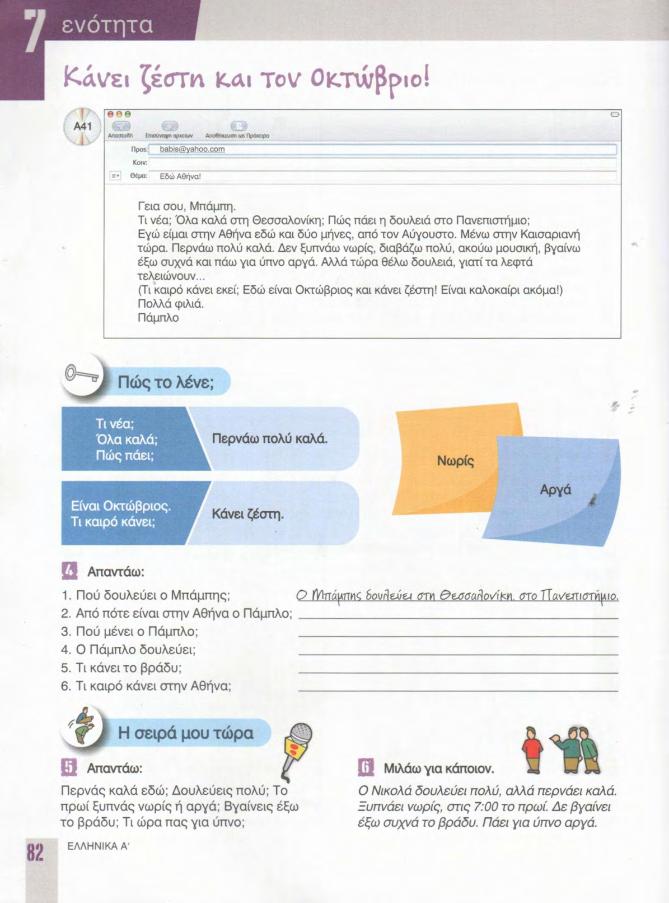

### Стр. 83

[83.png](raw/83.png)

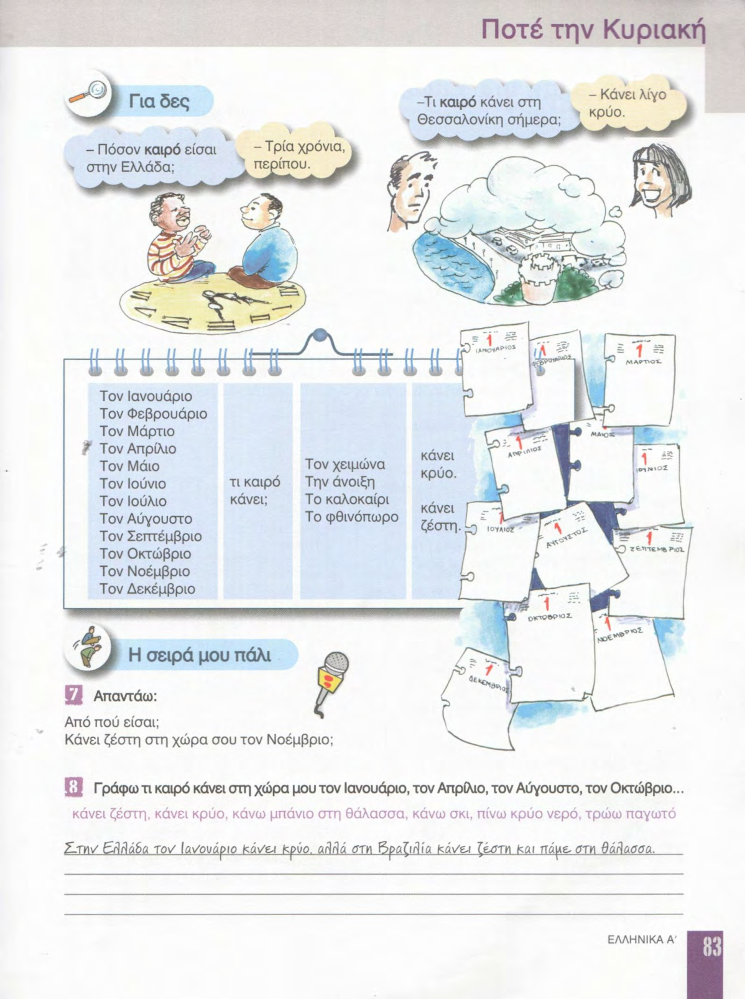

### Стр. 84

[84.png](raw/84.png)

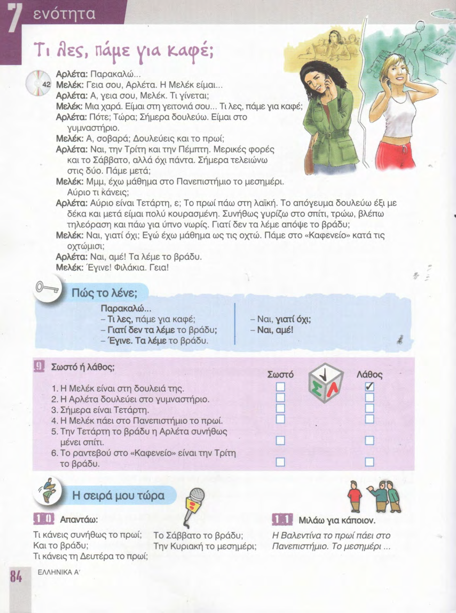

### Стр. 85

[85.png](raw/85.png)

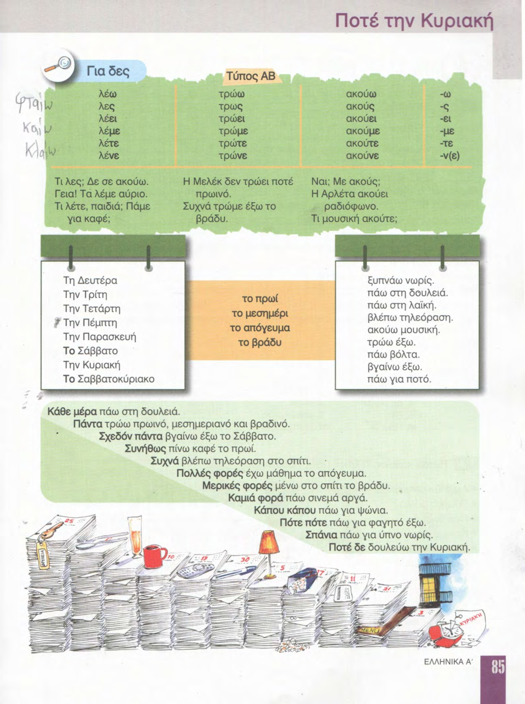

### Стр. 86

[86.png](raw/86.png)

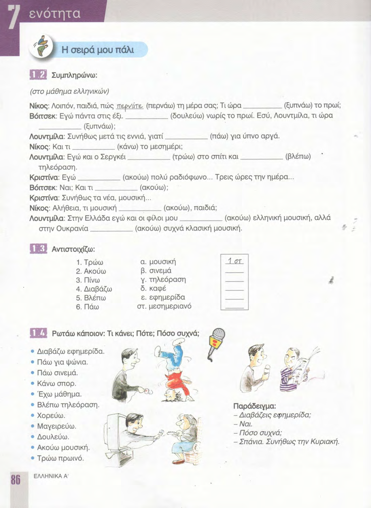

### Стр. 87

[87.png](raw/87.png)

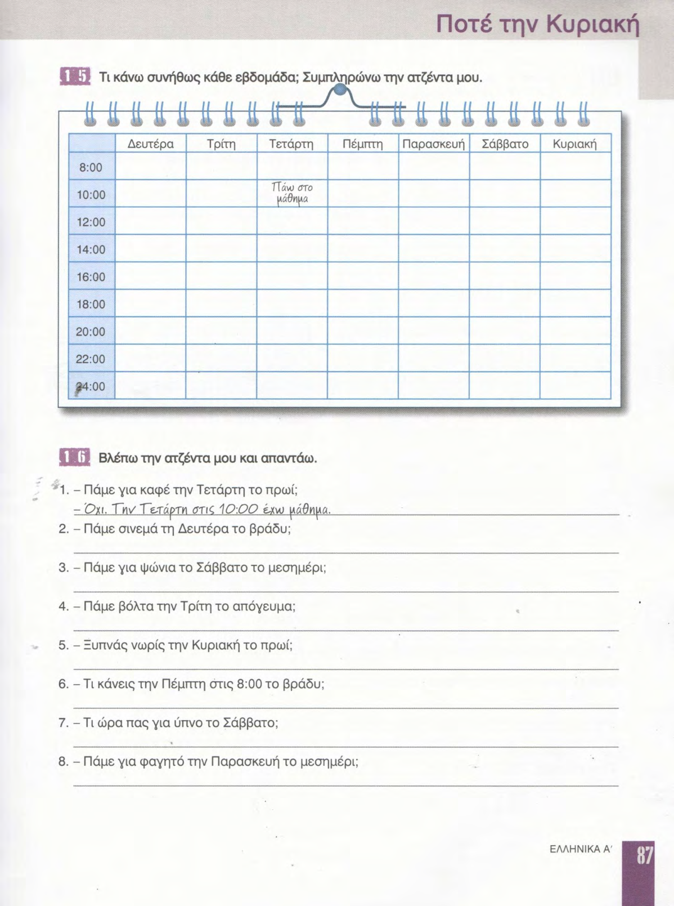

### Стр. 88

[88.png](raw/88.png)

### Стр. 89

[89.png](raw/89.png)

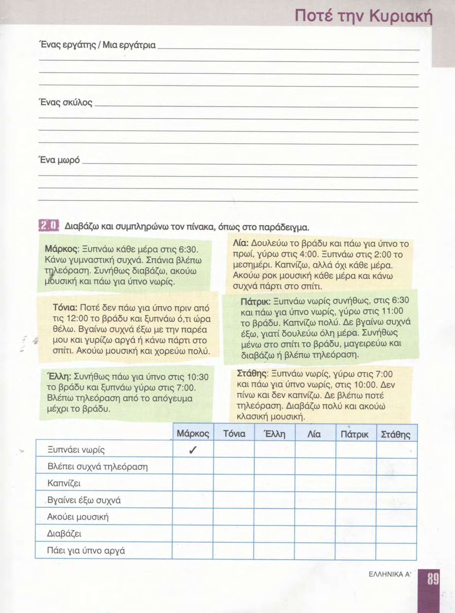

### Стр. 90

[90.png](raw/90.png)

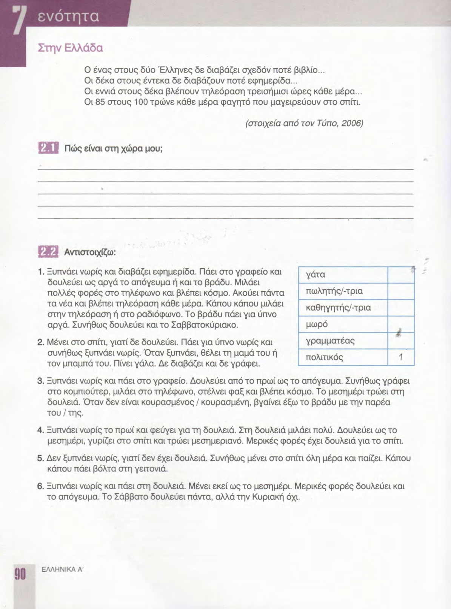

### Стр. 91

[91.png](raw/91.png)

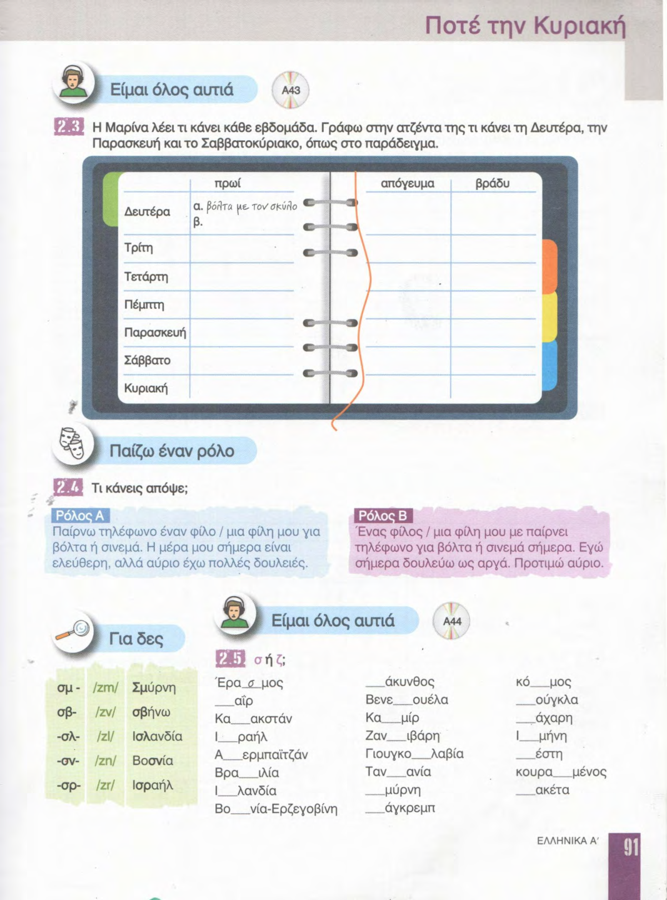

### Стр. 92

[92.png](raw/92.png)

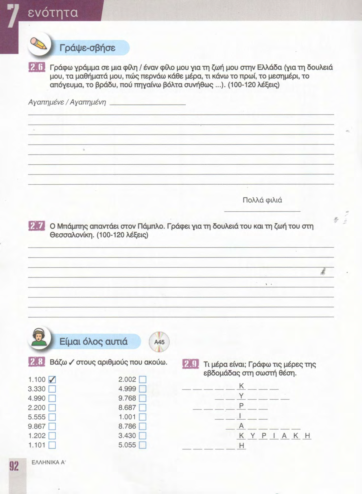

### Стр. 93

[93.png](raw/93.png)

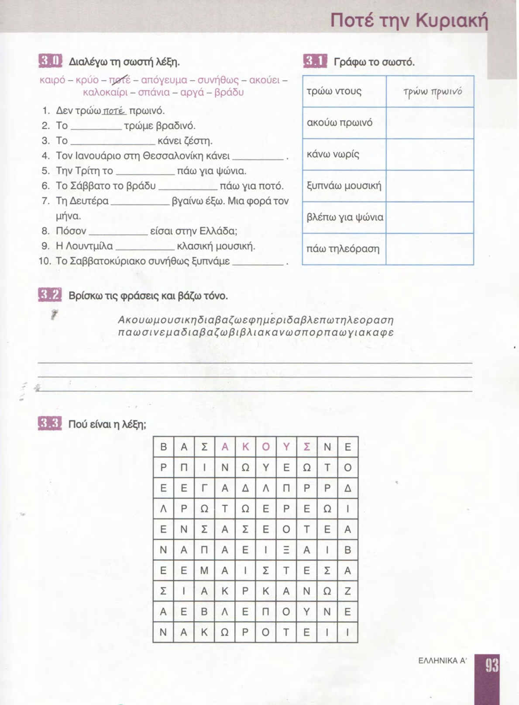
